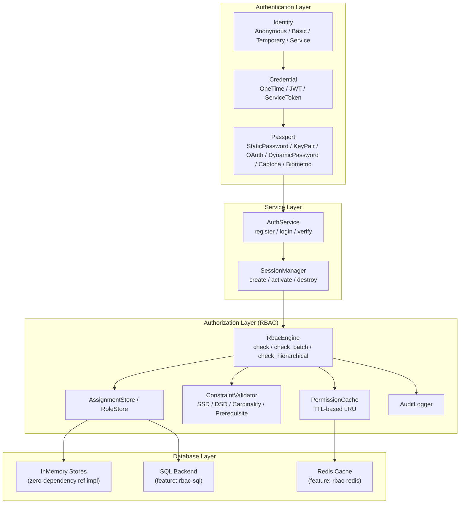
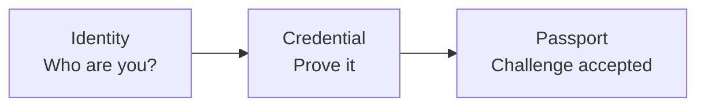
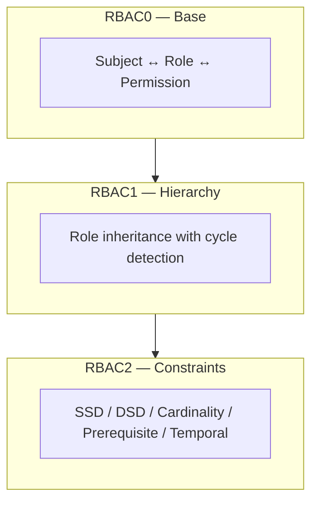
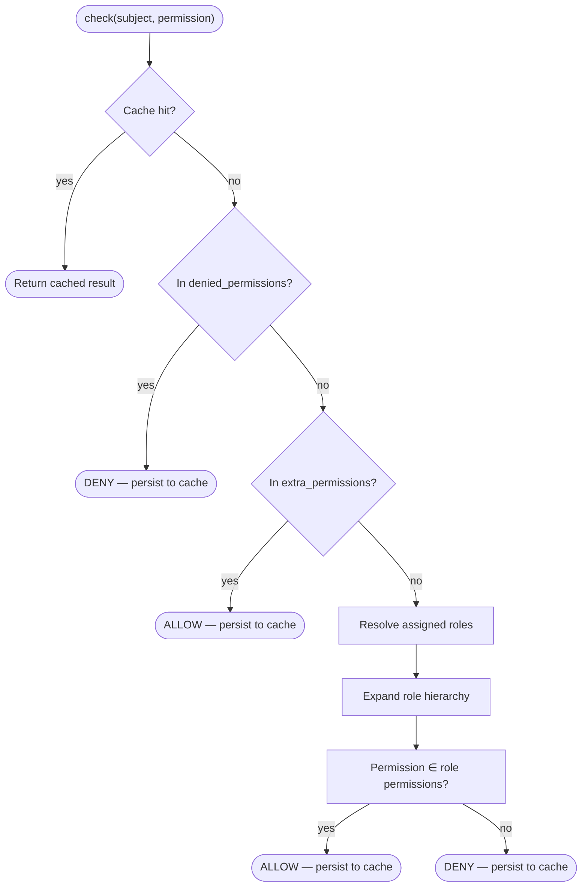

<h1 align="center">Kirino</h1>
<div align="center">
 <strong>
   Customizable Zero-Trust Authentication & RBAC Framework
 </strong>
</div>

<br />

<div align="center">
  <a href="https://github.com/celestia-island/kirino/actions">
    
  </a>
  <a href="https://crates.io/crates/kirino">
    
  </a>
  <a href="https://crates.io/crates/kirino">
    
  </a>
</div>

<div align="center">
  <h3>
    <a href="https://docs.rs/kirino">
      API Docs
    </a>
    <span> | </span>
    <a href="#quick-start">
      Quick Start
    </a>
    <span> | </span>
    <a href="#documentation">
      Documentation
    </a>
  </h3>
</div>

<br/>

A fully generic, trait-based authentication and authorization framework for Rust. Provides identity types, credential management, passport challenges, and a complete RBAC system (RBAC0/1/2) implementing the ANSI INCITS 359-2004 standard.

The name `kirino` comes from the character [Kirino](https://bluearchive.wiki/wiki/kirino) in the game [Blue Archive](https://bluearchive.jp/).

> Still in development, the API may change in the future.

## Features

- 🛡️ **Zero-Trust Architecture**: Anonymous, Basic, Temporary, and Service identity types
- 🔑 **Multi-Credential Support**: One-time tokens, JWT, service tokens, and more
- 🎫 **Passport Challenges**: Static password, key pair, OAuth, TOTP/HOTP, captcha, biometric
- 🔒 **Argon2 Password Hashing**: Secure password verification out of the box
- 🎯 **Full RBAC System**: RBAC0 (base), RBAC1 (hierarchy), RBAC2 (constraints)
- 🔄 **Role Inheritance**: Multi-level role hierarchies with cycle detection
- ⛓️ **Separation of Duty**: SSD (static) and DSD (dynamic) constraint enforcement
- 📊 **Cardinality & Prerequisite Constraints**: Limit role holders and enforce role prerequisites
- ⏱️ **Temporal Constraints**: Time-bounded role validity with automatic expiry
- 💾 **In-Memory First**: Zero-dependency reference implementations for all backends
- 🗄️ **Pluggable Storage**: Trait-based backends for SQL, Redis, and more
- 📝 **Audit Logging**: Permission check audit trail for compliance
- 🧩 **Fully Generic**: Define your own `Permission` and `Subject` types via traits
- ⚡ **Async/Tokio**: Built on async Rust with Tokio runtime
- 🔌 **JWT Integration**: Built-in JWT issuance and verification

## Quick Start

Add kirino to your `Cargo.toml`:

```toml
[dependencies]
kirino = "0.2"
tokio = { version = "1", features = ["full"] }
serde = { version = "1", features = ["derive"] }
```

Define your permissions and roles:

```rust
use kirino::rbac::prelude::*;

#[derive(Debug, Clone, PartialEq, Eq, Hash)]
enum MyPermission {
    DocumentRead,
    DocumentWrite,
    UserManage,
}

impl Permission for MyPermission {
    fn name(&self) -> &str {
        match self {
            Self::DocumentRead => "document:read",
            Self::DocumentWrite => "document:write",
            Self::UserManage => "user:manage",
        }
    }

    fn domain(&self) -> &str {
        match self {
            Self::DocumentRead | Self::DocumentWrite => "document",
            Self::UserManage => "user",
        }
    }
}

fn setup() {
    let mut role_registry = StaticRoleRegistry::new();
    role_registry.register(SimpleRole::new("admin", [
        MyPermission::DocumentRead, MyPermission::DocumentWrite,
        MyPermission::UserManage,
    ].into()));
    role_registry.register(SimpleRole::new("viewer", [
        MyPermission::DocumentRead,
    ].into()));

    let perm_registry = StaticPermissionRegistry::new([
        MyPermission::DocumentRead, MyPermission::DocumentWrite,
        MyPermission::UserManage,
    ].into());

    // Pass plain values — the engine wraps them internally via Shared<Arc>
    let engine = RbacEngine::new(role_registry, perm_registry, InMemoryAssignmentStore::new());
}
```

Or use the built-in `AuthService` for a complete setup:

```rust
use kirino::service::login::{AuthService, build_default_engine};

let engine = build_default_engine();
let service = AuthService::new(db, "jwt-secret", 24, engine, "admin", "viewer");
```

## Documentation

Multilingual documentation is available:

| Language | Index |
|----------|-------|
| English | [docs/en/guides/index.md](docs/en/guides/index.md) |
| 简体中文 (Simplified Chinese) | [docs/zhs/guides/index.md](docs/zhs/guides/index.md) |
| 繁體中文 (Traditional Chinese) | [docs/zht/guides/index.md](docs/zht/guides/index.md) |
| 日本語 (Japanese) | [docs/ja/guides/index.md](docs/ja/guides/index.md) |
| 한국어 (Korean) | [docs/ko/guides/index.md](docs/ko/guides/index.md) |
| Русский (Russian) | [docs/ru/guides/index.md](docs/ru/guides/index.md) |
| Español (Spanish) | [docs/es/guides/index.md](docs/es/guides/index.md) |
| Français (French) | [docs/fr/guides/index.md](docs/fr/guides/index.md) |

Crate-level API documentation is available at [docs.rs/kirino](https://docs.rs/kirino).

## Architecture

Kirino is a layered authentication and authorization framework:



## Core Concepts

### Authentication Pipeline

Kirino authenticates users through a three-step pipeline:



### RBAC Layers

Implements all three levels of the ANSI INCITS 359-2004 RBAC standard:



### Decision Flow



**Deny-override semantics**: Denied permissions always take precedence over granted ones — even over role-based or extra permissions.

### Identity Types

| Identity | Description |
|----------|-------------|
| **Anonymous** | Unauthenticated visitor, minimal permissions |
| **Basic** | Standard user, starts with minimal permissions |
| **Temporary** | Time-limited account, auto-expires |
| **Service** | Service account for permission delegation |

### Built-in Roles (Default Engine)

| Role | Permissions |
|------|-------------|
| `admin` | All permissions (13 across 6 domains) |
| `operator` | agent:*, config:read, knowledge:*, container:read, system:read |
| `viewer` | agent:read, config:read, knowledge:read, container:read, system:read |
| `agent` | agent:execute, agent:read |

## Feature Flags

```toml
[features]
default = []                    # RBAC core + in-memory backends
rbac-core = []                  # Traits and engine only
rbac-inmemory = ["rbac-core"]   # In-memory assignment/role stores
rbac-hierarchy = ["rbac-core"]  # RBAC1 hierarchical role inheritance
rbac-constraints = ["rbac-core"]# RBAC2 constraint models (SSD/DSD)
rbac-sql = ["rbac-core"]        # SQL-based persistent stores
rbac-sea-orm = ["rbac-core"]    # SeaORM entity models
rbac-redis = ["rbac-core"]      # Redis-based permission cache
rbac-full = [                   # All features enabled
    "rbac-inmemory", "rbac-hierarchy", "rbac-constraints",
    "rbac-sql", "rbac-sea-orm", "rbac-redis"
]
```

## Design Philosophy

Kirino is designed to be a **pure library** consumed by downstream projects:

- ✅ Provides generic trait-based abstractions for RBAC
- ✅ Implements ANSI INCITS 359-2004 standard (RBAC0/1/2)
- ✅ Zero-dependency in-memory reference implementations
- ✅ Domain-agnostic: define your own `Subject` and `Permission` types
- ✅ Deny-override semantics for security-first access control
- ✅ Cache-aware permission checks with TTL support

It does **not** prescribe:
- ❌ Specific permission or role types (you define your own)
- ❌ Authentication UI or middleware (library-level only)
- ❌ Database schema (trait-based — bring your own backend)
- ❌ Network protocols (expose via your own API layer)

## Requirements

- Rust 1.75+ (edition 2021)
- Tokio async runtime
- Optional: PostgreSQL (for `rbac-sql`), Redis (for `rbac-redis`)

## License

[Apache 2.0](https://github.com/celestia-island/kirino/blob/main/LICENSE)
