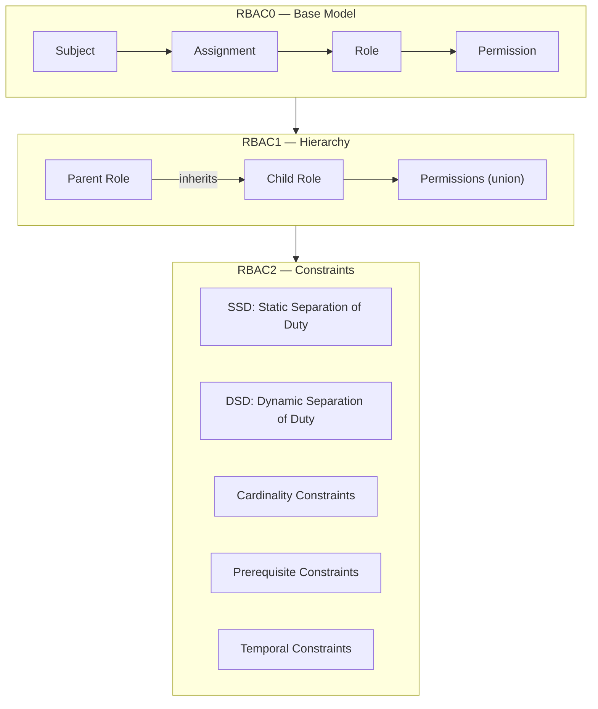
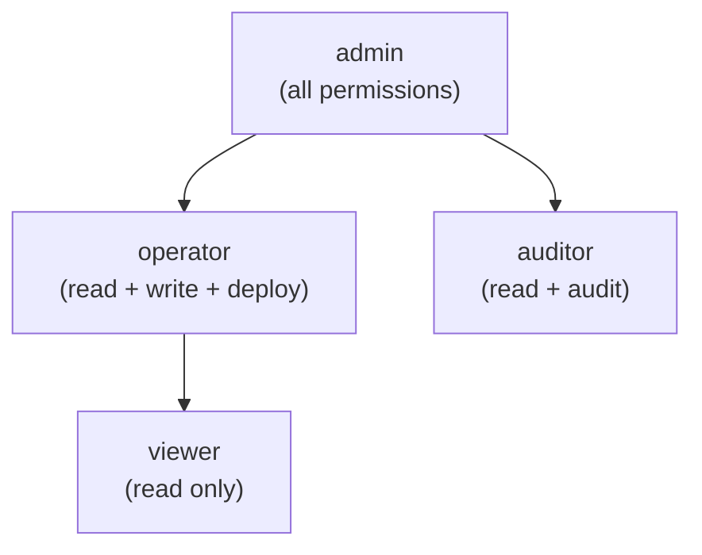
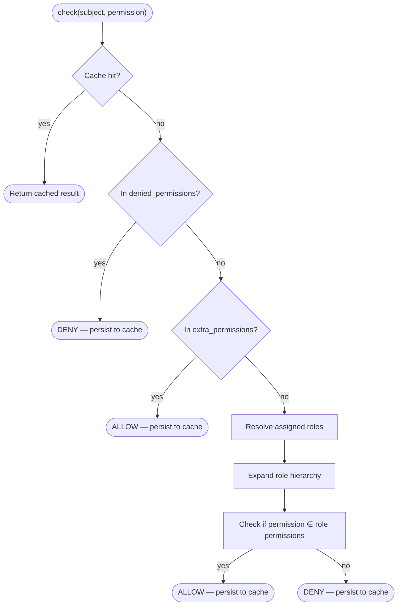
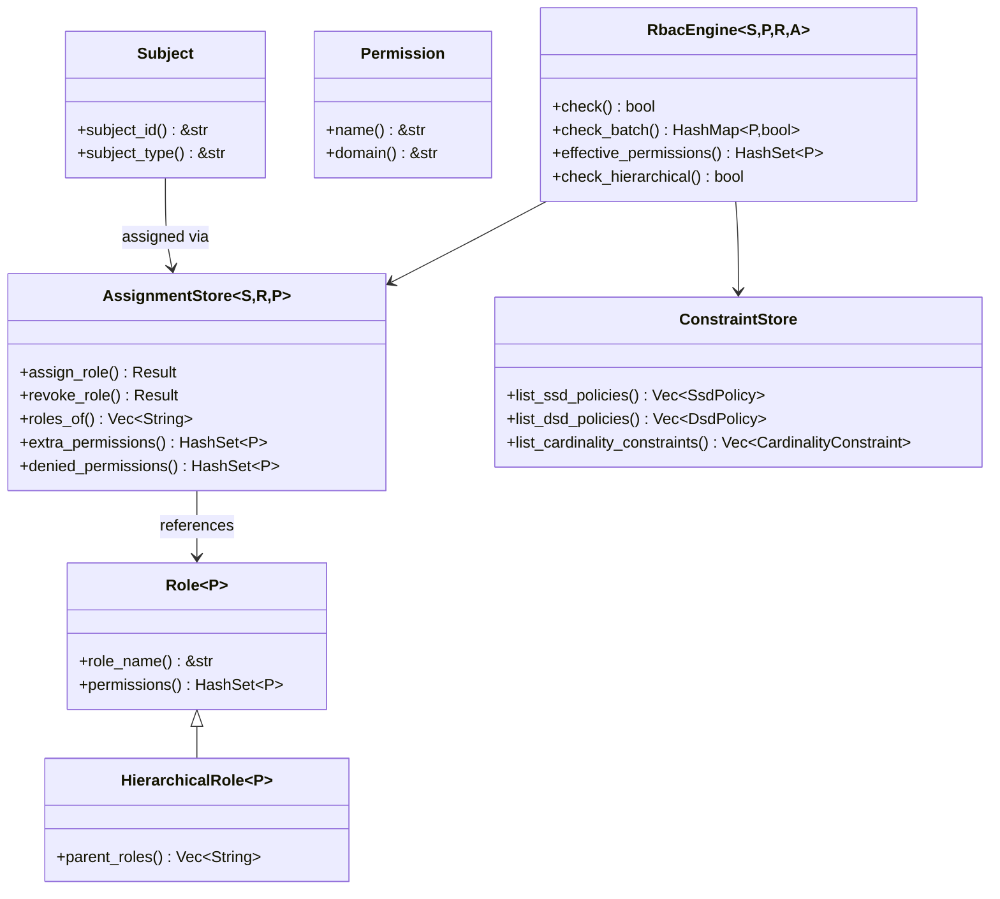

# المفاهيم الأساسية لـ RBAC

## ما هو RBAC؟

التحكّم في الوصول القائم على الأدوار (Role-Based Access Control أو RBAC) هو نموذج تخويل يُسند الصلاحيات إلى الأدوار، والأدوار إلى المستخدمين (الكيانات). يُبسّط هذا المستوى من الإسناد غير المباشر إدارة الصلاحيات على نطاق واسع — فبدلاً من منح الصلاحيات لكل مستخدم على حدة، فإنك تُسندها إلى دور.

## الكيانات الأساسية

### الكيـان (Subject)

**الكيـان** هو أي طرف يمكن أن تُمنح له صلاحيات — عادةً مستخدماً، أو حساب خدمة، أو وكيلاً آلياً. في kirino، تُطبّق الكيانات السمة `Subject`:

| السمة (Trait) | الغرض |
|-------|---------|
| `Subject` | السمة الأساسية لأي كيان قابل للتخويل |
| `Delegatable` | كيان يستطيع تفويض صلاحياته إلى كيان آخر |

### الصلاحية (Permission)

**الصلاحية** هي الوحدة الذرية للتخويل — إجراء مُسمّى على نطاق مورد:

| السمة (Trait) | الغرض |
|-------|---------|
| `Permission` | `name() -> &str` للتسلسل، و `domain() -> &str` للتجميع |

### الدور (Role)

**الدور** هو مجموعة مُسمّاة من الصلاحيات:

| السمة (Trait) | الغرض |
|-------|---------|
| `Role<P>` | الدور الأساسي: يحمل مجموعة من الصلاحيات |
| `HierarchicalRole<P>` | يوسّع `Role<P>` عبر `parent_roles()` للوراثة |

## مستويات RBAC

يُطبّق kirino معيار ANSI INCITS 359-2004 على ثلاثة مستويات:



### RBAC0 — النموذج الأساسي

الأساس: يُسنَد المستخدمون إلى الأدوار، وتحمل الأدوار الصلاحيات.

```
Subject ──assigned──→ Role ──contains──→ Permission
```

- يحصل المستخدم صاحب دور "editor" على جميع صلاحيات دور "editor".
- دلالات تجاوز الرفض (Deny-override): تأخذ `denied_permissions` الأولوية على الصلاحيات الممنوحة.
- الصلاحيات الإضافية (Extra permissions): رفع مؤقت دون تغيير إسناد الدور.

### RBAC1 — النموذج الهرمي

يمكن للأدوار أن **ترث** من أدوار أبوية، مكوّنةً شجرة صلاحيات:



- ترث الأدوار الابنة جميع صلاحيات أدوارها الأم (دلالات الاتحاد).
- يمنع كشف الحلقات (cycle detection) الوقوع في حلقات لا نهائية أثناء حلّ الوراثة.
- يُدعم الوراثة المتعددة: يمكن للدور أن يمتلك عدّة آباء.

### RBAC2 — نموذج القيود

تُطبّق القيود فصل المهام وغيرها من القواعد المنطقية:

#### الفصل الساكن للمهام (SSD)

لا يمكن **إسناد** الأدوار المتعارضة إلى المستخدم نفسه.

```
SsdPolicy { roles: {"billing", "auditor"}, cardinality: 2 }
→ لا يمكن للمستخدم أن يحمل كلًا من "billing" و"auditor" في الوقت نفسه.
```

#### الفصل الديناميكي للمهام (DSD)

يمكن **إسناد** الأدوار المتعارضة لكنها **لا يمكن أن تكون نشطة** في الجلسة نفسها.

```
DsdPolicy { roles: {"author", "reviewer"}, cardinality: 2 }
→ يمكن للمستخدم أن يكون مؤلفًا ومراجعًا في آنٍ واحد، لكنه يفعّل دورًا واحدًا فقط لكل جلسة.
```

#### قيد العدد (Cardinality Constraint)

يحدّ عدد المستخدمين الذين يمكنهم حمل دور معيّن.

```
CardinalityConstraint { role: "admin", max: 3 }
→ يمكن لثلاثة مستخدمين كحد أقصى أن يكونوا مسؤولين.
```

#### قيد المتطلّب السابق (Prerequisite Constraint)

يجب على المستخدم أن يحمل الدور A قبل أن يُسنَد إليه الدور B.

```
PrerequisiteConstraint { role: "operator", requires: "viewer" }
→ يمكن فقط للمشاهدين الحاليين الترقية إلى مشغّل.
```

#### القيد الزمني (Temporal Constraint)

يكون الدور صالحاً فقط ضمن نافذة زمنية محدّدة.

```
TemporalConstraint { role: "temp-admin", valid_from: ..., valid_until: ... }
→ ينتهي تلقائيًا؛ يُسحب تلقائيًا بعد valid_until.
```

## تدفّق القرار

عند استدعاء `RbacEngine::check(subject, permission)`:



الدلالة الأساسية: **الرفض له الأولوية**. لا يمكن لصلاحية مرفوضة أن تُمنح عبر الأدوار أو الصلاحيات الإضافية.

## ملخّص السمات الرئيسية


