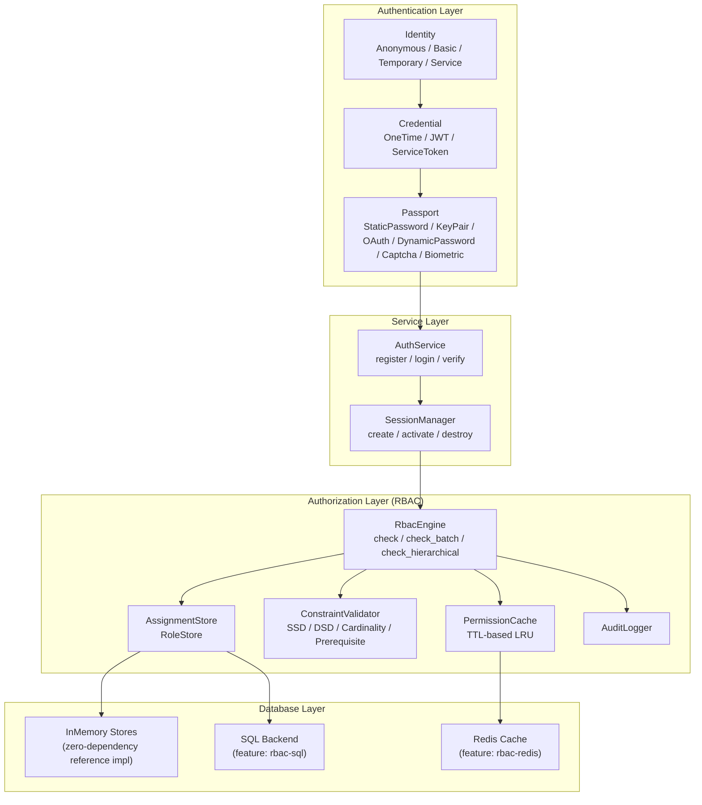
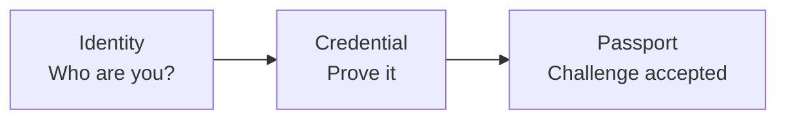
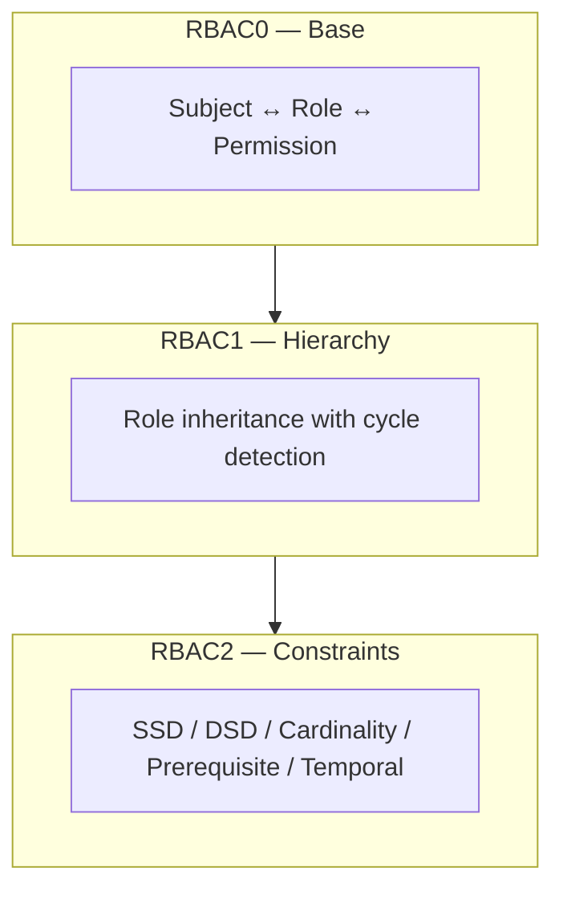
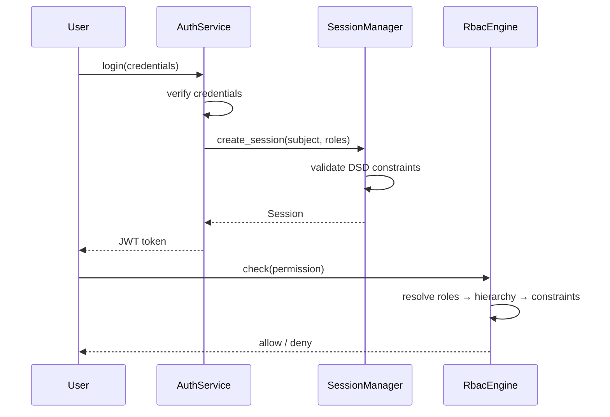

# نظرة عامة على النظام

kirino هو إطار مُصادقة وتخويل متعدّد الطبقات. تبني كل طبقة على ما تحتها، مع حدود سمات (trait) واضحة تتيح التخصيص.

## طبقة المصادقة

يُصادِق kirino المستخدمين عبر خط أنابيب من ثلاث خطوات:

### أنواع الهوية (Identity Types)

| النوع | الوصف |
|------|-------------|
| **Anonymous** | زائر غير مُصادَق، صلاحيات محدودة |
| **Basic** | مستخدم اعتيادي، يبدأ بصلاحيات محدودة |
| **Temporary** | حساب محدود زمنياً، ينتهي تلقائياً |
| **Service** | حساب خدمة لتفويض الصلاحيات |

### أنواع البيان الاعتمادي (Credential Types)

| النوع | الوصف |
|------|-------------|
| **OneTimeToken** | رمز يُستخدم مرة واحدة، يُستهلك عند أول استخدام |
| **Basic (JWT)** | JSON Web Token يحوي مطالبات (claims) وانتهاء صلاحية |
| **ServiceToken** | رمز طويل الأمد لحسابات الخدمة |

### أنواع جواز المرور / التحدّي (Passport Types)

| النوع | الوصف |
|------|-------------|
| **StaticPassword** | كلمة مرور تُتحقّق عبر argon2 |
| **KeyPair** | تحقّق مفتاح SSH أو شهادة TLS |
| **OAuth** | مزوّد OAuth من طرف ثالث |
| **DynamicPassword** | TOTP/HOTP، رمز بريد إلكتروني، رمز SMS |
| **Captcha** | reCAPTCHA أو ما يشبهها لكشف البوتّات |
| **Biological** | بصمة إصبع، صوت، التعرّف على الوجه |
| **TemporaryWhitelist** | إدراج في القائمة البيضاء محدود زمنياً |

## طبقة التخويل

يتبع محرّك RBAC معيار ANSI INCITS 359-2004 ويُطبّق مستويات RBAC الثلاثة كافةً:

### مبادئ التصميم الأساسية

1. **عام بالكامل**: تُعرّف المشاريع النهائية أنواع `Permission` و`Subject` الخاصة بها عبر السمات.
2. **دلالات تجاوز الرفض**: تأخذ الصلاحيات المرفوضة الأولوية دائماً.
3. **الذاكرة أولاً**: لكل المخازن الخلفية تطبيقات مرجعية صفرية التبعية.
4. **متعدّد الطبقات**: تُطبَّق RBAC0/1/2 ككتل impl منفصلة على `RbacEngine`.
5. **مدرك للذاكرة المؤقتة**: تُخزَّن فحوصات الصلاحيات مؤقتاً مع TTL للأداء.

## إدارة الجلسات

تربط الجلسات بين المصادقة والتخويل:

## من أين تبدأ

- **البدء السريع**: راجع [دليل البدء السريع](../guides/quick-start.md) لإعداد أدنى.
- **مفاهيم RBAC**: راجع [المفاهيم الأساسية لـ RBAC](../guides/concepts.md) لنظرية RBAC بالتفصيل.
- **التثبيت**: راجع [دليل التثبيت](../guides/installation.md) لأعلام الميزات والتبعيات.
- **المصطلحات**: راجع [المصطلحات](../guides/glossary.md) لتعريفات المصطلحات الأساسية.
