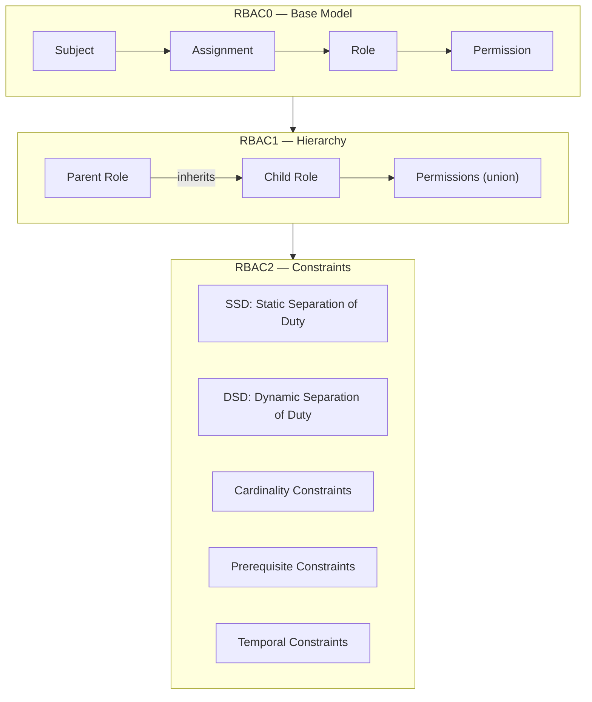
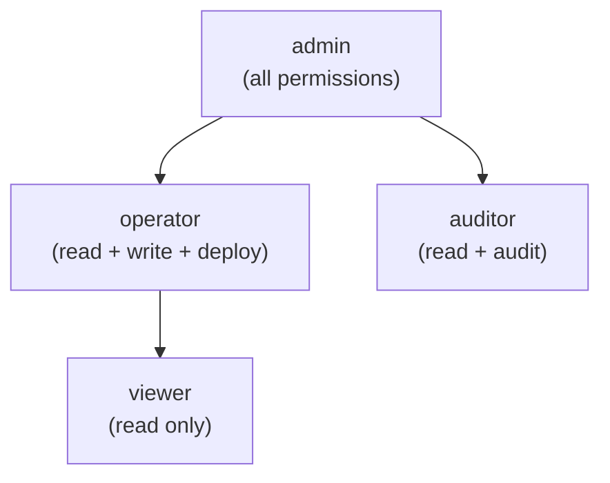
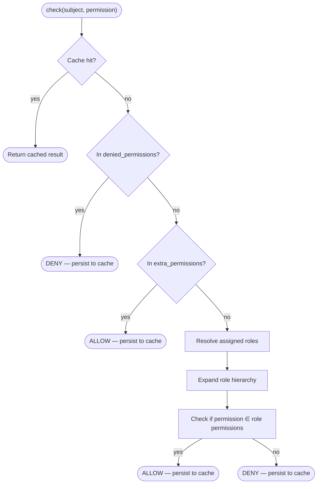
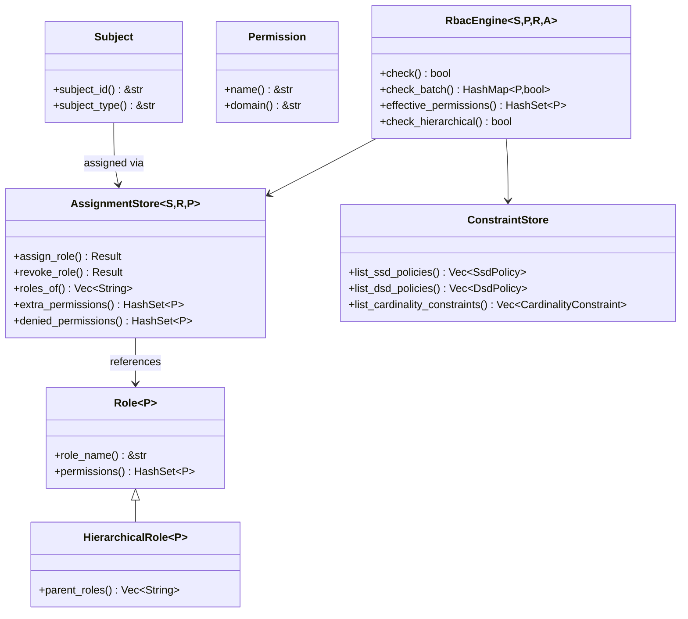

# RBAC Core Concepts

## What is RBAC?

Role-Based Access Control (RBAC) is an authorization model that assigns permissions to roles, and roles to users (subjects). This indirection simplifies permission management at scale — instead of granting permissions to each user individually, you assign them to a role.

## Core Entities

### Subject

A **Subject** is any entity that can be granted permissions — typically a user, service account, or automated agent. In kirino, subjects implement the `Subject` trait:

| Trait | Purpose |
|-------|---------|
| `Subject` | Base trait for any authorizable entity |
| `Delegatable` | A subject that can delegate its permissions to another subject |

### Permission

A **Permission** is the atomic unit of authorization — a named action on a resource domain:

| Trait | Purpose |
|-------|---------|
| `Permission` | `name() -> &str` for serialization, `domain() -> &str` for grouping |

### Role

A **Role** is a named collection of permissions:

| Trait | Purpose |
|-------|---------|
| `Role<P>` | Base role: holds a set of permissions |
| `HierarchicalRole<P>` | Extends `Role<P>` with `parent_roles()` for inheritance |

## RBAC Levels

Kirino implements the ANSI INCITS 359-2004 standard across three levels:



### RBAC0 — Base Model

The foundation: users are assigned to roles, roles hold permissions.

```
Subject ──assigned──→ Role ──contains──→ Permission
```

- A user with role "editor" gets all permissions in the "editor" role.
- Deny-override semantics: `denied_permissions` take priority over granted ones.
- Extra permissions: temporary elevation without changing role assignment.

### RBAC1 — Hierarchical Model

Roles can **inherit** from parent roles, forming a permission tree:



- Child roles inherit all permissions of their parents (union semantics).
- Cycle detection prevents infinite loops during inheritance resolution.
- Multi-inheritance supported: a role can have multiple parents.

### RBAC2 — Constraint Model

Constraints enforce separation of duty and other business rules:

#### Static Separation of Duty (SSD)

Conflicting roles **cannot be assigned** to the same user.

```
SsdPolicy { roles: {"billing", "auditor"}, cardinality: 2 }
→ A user cannot hold both "billing" and "auditor" simultaneously.
```

#### Dynamic Separation of Duty (DSD)

Conflicting roles **can be assigned** but **cannot be active** in the same session.

```
DsdPolicy { roles: {"author", "reviewer"}, cardinality: 2 }
→ A user can be both author and reviewer, but only activate one per session.
```

#### Cardinality Constraint

Limits how many users can hold a given role.

```
CardinalityConstraint { role: "admin", max: 3 }
→ At most 3 users can be administrators.
```

#### Prerequisite Constraint

A user must hold role A before being assigned role B.

```
PrerequisiteConstraint { role: "operator", requires: "viewer" }
→ Only existing viewers can be promoted to operator.
```

#### Temporal Constraint

A role is only valid within a time window.

```
TemporalConstraint { role: "temp-admin", valid_from: ..., valid_until: ... }
→ Auto-expires; automatically revoked after valid_until.
```

## Decision Flow

When `RbacEngine::check(subject, permission)` is called:



Key semantic: **Deny takes precedence**. A denied permission cannot be granted by roles or extra permissions.

## Key Traits Summary


