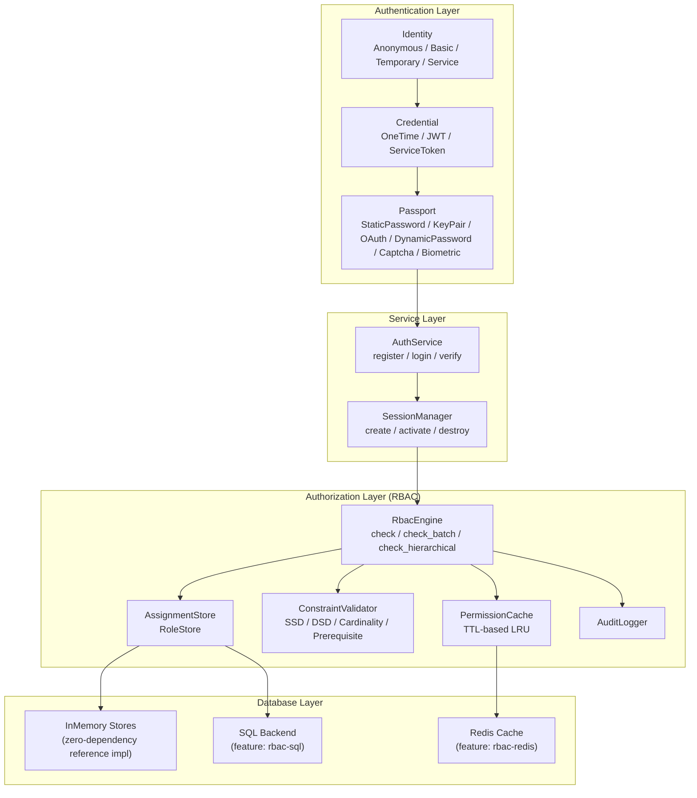
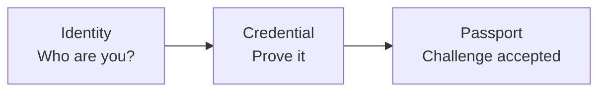
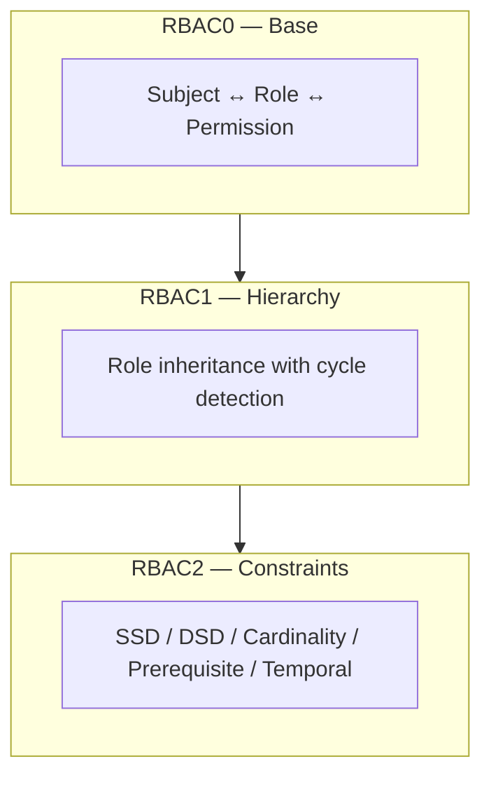
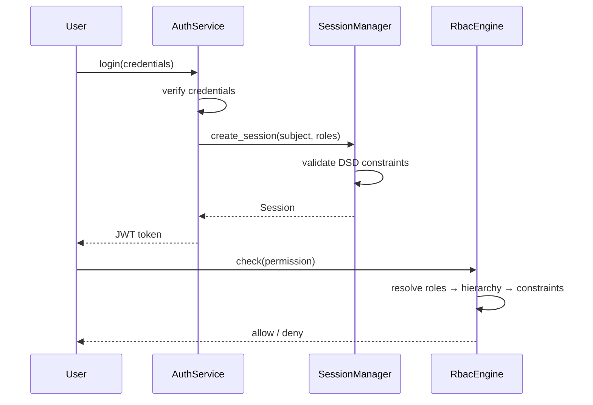

# System Overview

Kirino is a layered authentication and authorization framework. Each layer builds on the one below it, with clear trait boundaries for customization.

## Authentication Layer

Kirino authenticates users through a three-step pipeline:

### Identity Types

| Type | Description |
|------|-------------|
| **Anonymous** | Unauthenticated visitor, minimal permissions |
| **Basic** | Standard user, starts with minimal permissions |
| **Temporary** | Time-limited account, auto-expires |
| **Service** | Service account for permission delegation |

### Credential Types

| Type | Description |
|------|-------------|
| **OneTimeToken** | Single-use token, consumed on first use |
| **Basic (JWT)** | JSON Web Token with claims and expiry |
| **ServiceToken** | Long-lived token for service accounts |

### Passport (Challenge) Types

| Type | Description |
|------|-------------|
| **StaticPassword** | Password verified via argon2 |
| **KeyPair** | SSH key or TLS certificate verification |
| **OAuth** | Third-party OAuth provider |
| **DynamicPassword** | TOTP/HOTP, email code, SMS code |
| **Captcha** | reCAPTCHA or similar bot detection |
| **Biological** | Fingerprint, voice, face recognition |
| **TemporaryWhitelist** | Time-limited whitelist entry |

## Authorization Layer

The RBAC engine follows the ANSI INCITS 359-2004 standard and implements all three RBAC levels:

### Core Design Principles

1. **Fully generic**: Downstream projects define their own `Permission` and `Subject` types via traits.
2. **Deny-override semantics**: Denied permissions always take precedence.
3. **In-memory first**: All backends have zero-dependency reference implementations.
4. **Layered**: RBAC0/1/2 are layered as separate impl blocks on `RbacEngine`.
5. **Cache-aware**: Permission checks are cached with TTL for performance.

## Session Management

Sessions bridge authentication and authorization:

## Where to Start

- **Quick start**: See [Quick Start Guide](../guides/quick-start.md) for a minimal setup.
- **RBAC concepts**: See [RBAC Core Concepts](../guides/concepts.md) for detailed RBAC theory.
- **Installation**: See [Installation Guide](../guides/installation.md) for feature flags and dependencies.
- **Glossary**: See [Glossary](../guides/glossary.md) for key term definitions.
