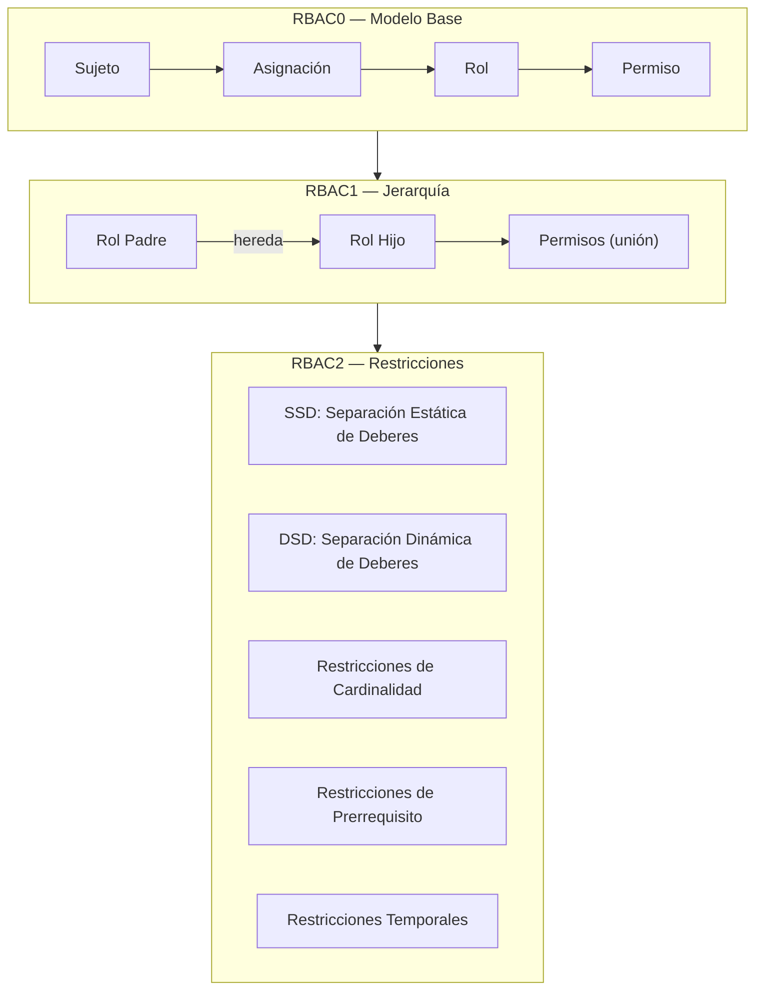
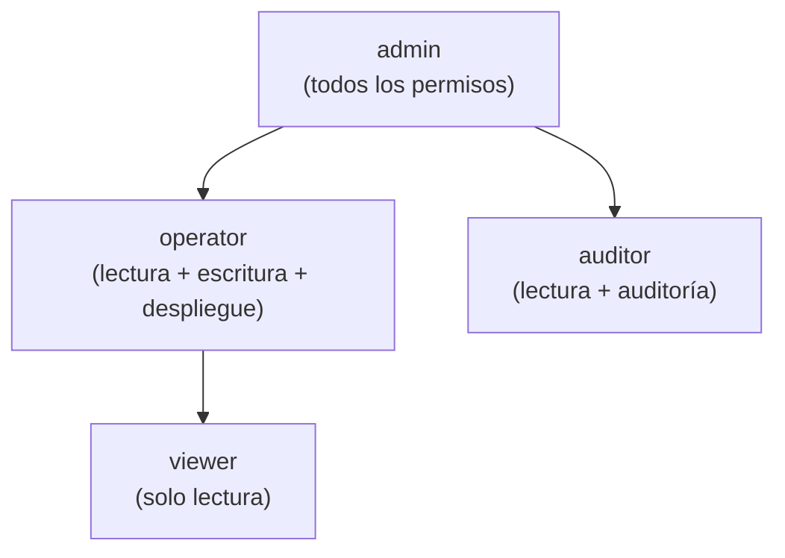
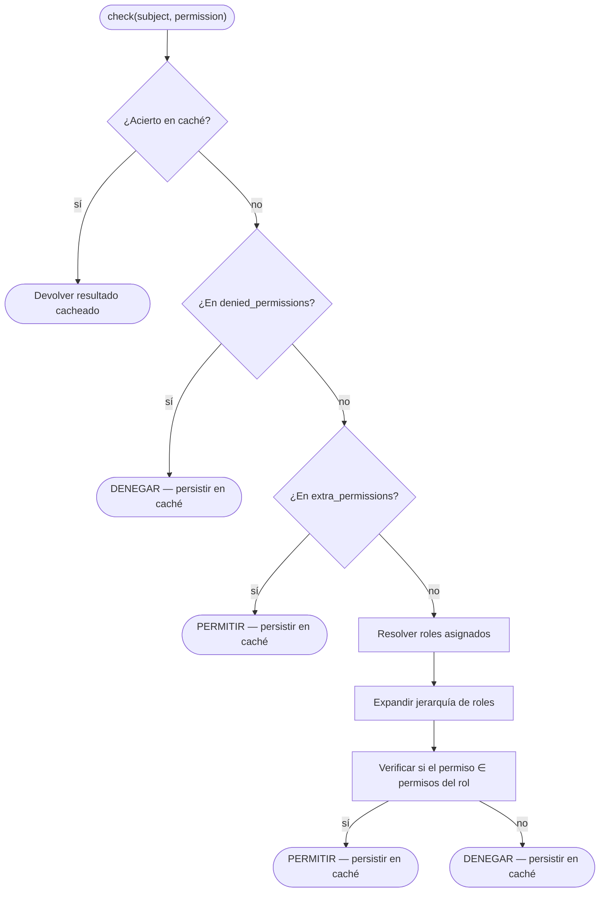
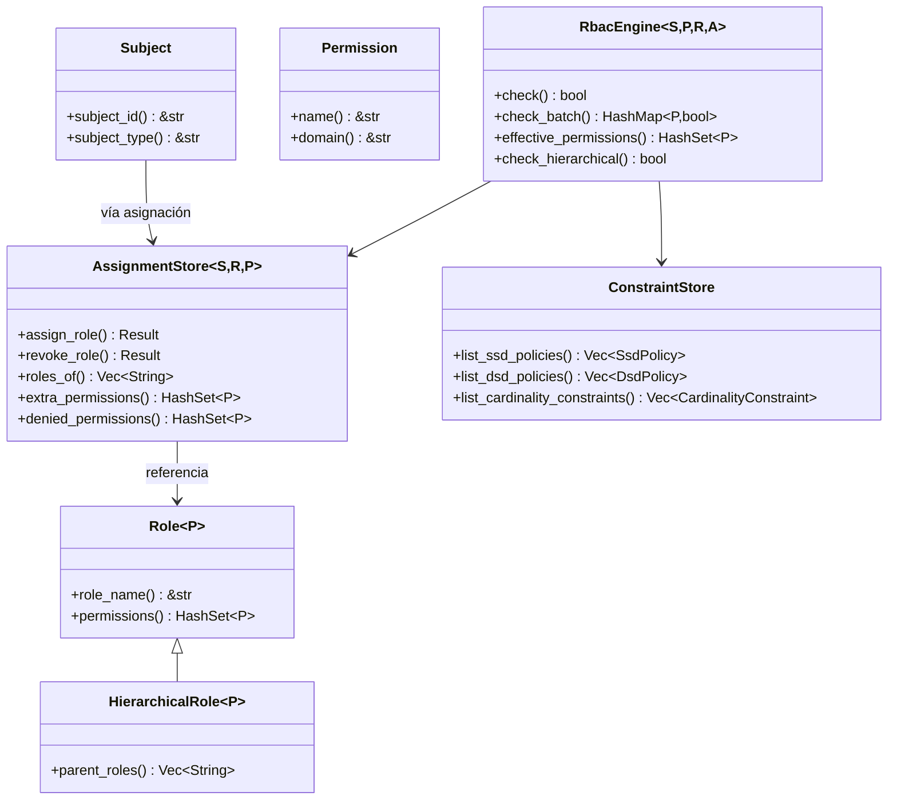

# Conceptos Básicos de RBAC

## ¿Qué es RBAC?

El Control de Acceso Basado en Roles (RBAC) es un modelo de autorización que asigna permisos a roles, y roles a usuarios (sujetos). Esta indirección simplifica la gestión de permisos a escala — en lugar de otorgar permisos a cada usuario individualmente, los asignas a un rol.

## Entidades Principales

### Sujeto (Subject)

Un **Sujeto** es cualquier entidad a la que se le pueden otorgar permisos — típicamente un usuario, cuenta de servicio o agente automatizado. En kirino, los sujetos implementan el trait `Subject`:

| Trait | Propósito |
|-------|---------|
| `Subject` | Trait base para cualquier entidad autorizable |
| `Delegatable` | Un sujeto que puede delegar sus permisos a otro sujeto |

### Permiso (Permission)

Un **Permiso** es la unidad atómica de autorización — una acción nombrada sobre un dominio de recurso:

| Trait | Propósito |
|-------|---------|
| `Permission` | `name() -> &str` para serialización, `domain() -> &str` para agrupación |

### Rol (Role)

Un **Rol** es una colección nombrada de permisos:

| Trait | Propósito |
|-------|---------|
| `Role<P>` | Rol base: contiene un conjunto de permisos |
| `HierarchicalRole<P>` | Extiende `Role<P>`, agrega `parent_roles()` para herencia |

## Niveles de RBAC

Kirino implementa los tres niveles del estándar ANSI INCITS 359-2004:



### RBAC0 — Modelo Base

La base: los usuarios se asignan a roles, los roles contienen permisos.

```
Sujeto ──asignado──→ Rol ──contiene──→ Permiso
```

- Un usuario con el rol "editor" obtiene todos los permisos del rol "editor".
- Semántica de denegación prioritaria: `denied_permissions` tiene prioridad sobre los otorgados.
- Permisos extra: elevación temporal sin cambiar la asignación de rol.

### RBAC1 — Modelo Jerárquico

Los roles pueden **heredar** de roles padre, formando un árbol de permisos:



- Los roles hijo heredan todos los permisos de los padres (semántica de unión).
- La detección de ciclos previene bucles infinitos durante la resolución de herencia.
- Herencia múltiple soportada: un rol puede tener múltiples padres.

### RBAC2 — Modelo de Restricciones

Las restricciones imponen separación de deberes y otras reglas de negocio:

#### Separación Estática de Deberes (SSD)

Los roles en conflicto **no pueden asignarse** al mismo usuario.

```
SsdPolicy { roles: {"billing", "auditor"}, cardinality: 2 }
→ Un usuario no puede tener simultáneamente "billing" y "auditor".
```

#### Separación Dinámica de Deberes (DSD)

Los roles en conflicto **pueden asignarse** pero **no pueden activarse** en la misma sesión.

```
DsdPolicy { roles: {"author", "reviewer"}, cardinality: 2 }
→ Un usuario puede ser author y reviewer, pero solo activar uno por sesión.
```

#### Restricción de Cardinalidad

Limita cuántos usuarios pueden tener un rol determinado.

```
CardinalityConstraint { role: "admin", max: 3 }
→ Como máximo 3 usuarios pueden ser administradores.
```

#### Restricción de Prerrequisito

Un usuario debe tener el rol A antes de que se le asigne el rol B.

```
PrerequisiteConstraint { role: "operator", requires: "viewer" }
→ Solo los viewer existentes pueden ser promovidos a operator.
```

#### Restricción Temporal

Un rol solo es válido dentro de una ventana de tiempo.

```
TemporalConstraint { role: "temp-admin", valid_from: ..., valid_until: ... }
→ Expira automáticamente; se revoca automáticamente después de valid_until.
```

## Flujo de Decisión

Cuando se llama a `RbacEngine::check(subject, permission)`:



Semántica clave: **la denegación tiene prioridad**. Un permiso denegado no puede ser otorgado por roles o permisos extra.

## Resumen de Traits Clave


