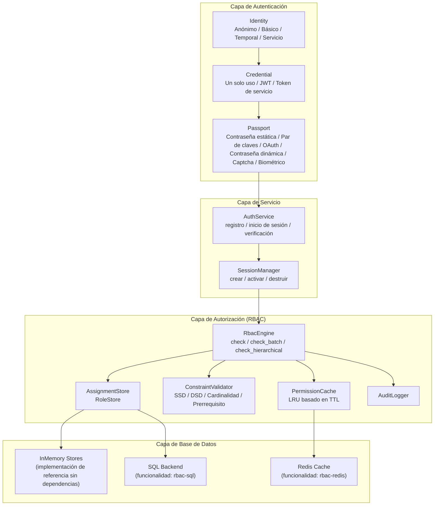
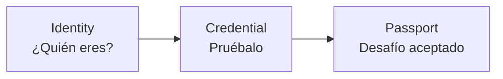
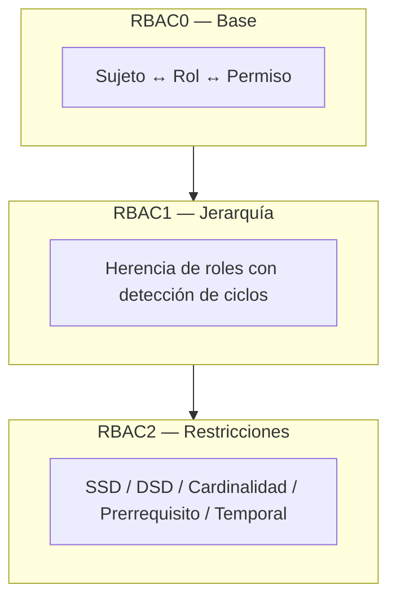
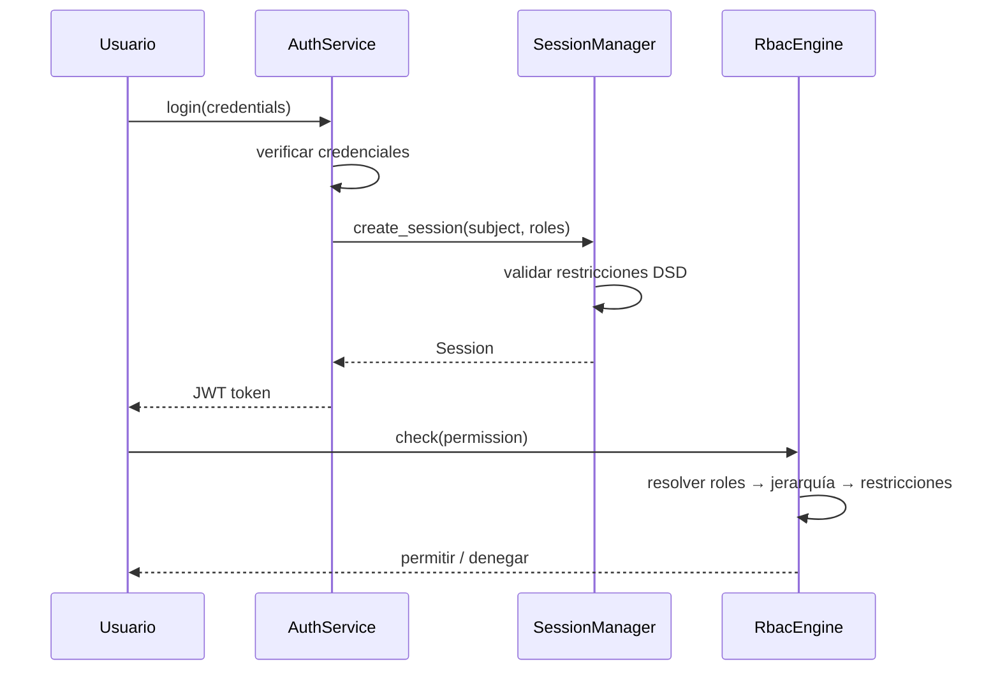

# Visión General del Sistema

Kirino es un framework de autenticación y autorización en capas. Cada capa se construye sobre la inferior, con límites de trait claros para personalización.

## Capa de Autenticación

Kirino autentica usuarios a través de un pipeline de tres pasos:

### Tipos de Identidad

| Tipo | Descripción |
|------|-------------|
| **Anonymous (Anónimo)** | Visitante no autenticado, permisos mínimos |
| **Basic (Básico)** | Usuario estándar, comienza con permisos mínimos |
| **Temporary (Temporal)** | Cuenta con límite de tiempo, expira automáticamente |
| **Service (Servicio)** | Cuenta de servicio para delegación de permisos |

### Tipos de Credencial

| Tipo | Descripción |
|------|-------------|
| **OneTimeToken** | Token de un solo uso, se consume en el primer uso |
| **Basic (JWT)** | JSON Web Token con claims y expiración |
| **ServiceToken** | Token de larga duración para cuentas de servicio |

### Tipos de Pasaporte (Desafío)

| Tipo | Descripción |
|------|-------------|
| **StaticPassword** | Contraseña verificada mediante argon2 |
| **KeyPair** | Verificación de clave SSH o certificado TLS |
| **OAuth** | Proveedor OAuth de terceros |
| **DynamicPassword** | TOTP/HOTP, código por email, código SMS |
| **Captcha** | reCAPTCHA o detección de bots similar |
| **Biological** | Huella dactilar, voz, reconocimiento facial |
| **TemporaryWhitelist** | Entrada temporal en lista blanca |

## Capa de Autorización

El motor RBAC sigue el estándar ANSI INCITS 359-2004 e implementa los tres niveles RBAC:

### Principios de Diseño Fundamentales

1. **Completamente genérico**: Los proyectos consumidores definen sus propios tipos `Permission` y `Subject` mediante traits.
2. **Semántica de denegación prioritaria**: Los permisos denegados siempre tienen prioridad.
3. **Primero en memoria**: Todos los backends tienen implementaciones de referencia sin dependencias.
4. **En capas**: RBAC0/1/2 se implementan como bloques impl separados en `RbacEngine`.
5. **Conciente de caché**: Las verificaciones de permisos se cachean con TTL para rendimiento.

## Gestión de Sesiones

Las sesiones conectan la autenticación y la autorización:

## Por Dónde Empezar

- **Inicio rápido**: Consulta la [Guía de Inicio Rápido](../guides/quick-start.md) para una configuración mínima.
- **Conceptos RBAC**: Consulta [Conceptos Básicos de RBAC](../guides/concepts.md) para teoría detallada.
- **Instalación**: Consulta la [Guía de Instalación](../guides/installation.md) para banderas y dependencias.
- **Glosario**: Consulta el [Glosario](../guides/glossary.md) para definiciones de términos clave.
