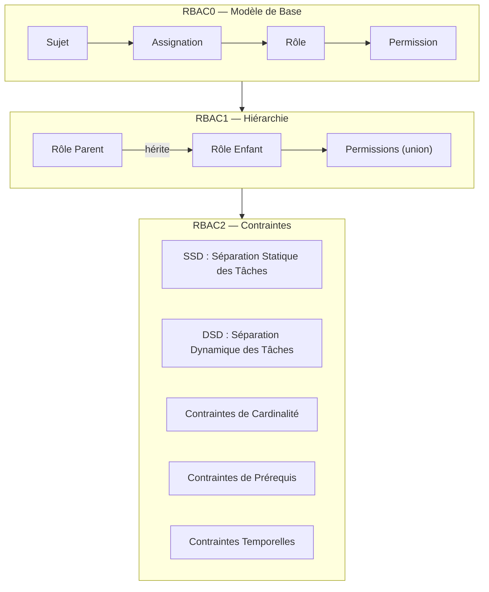
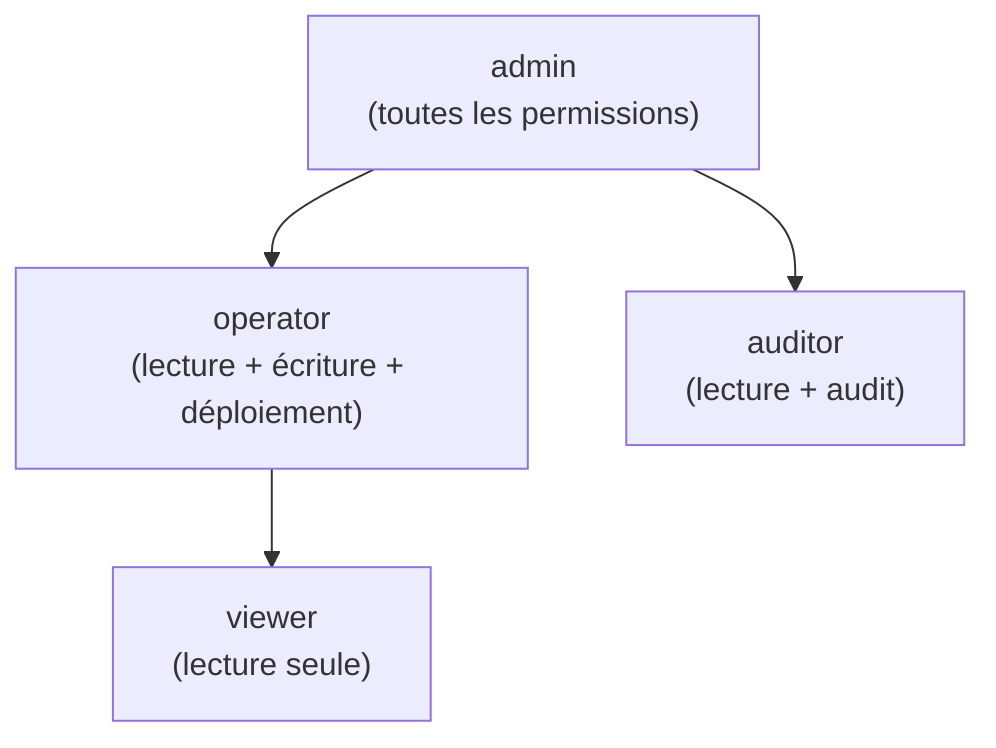
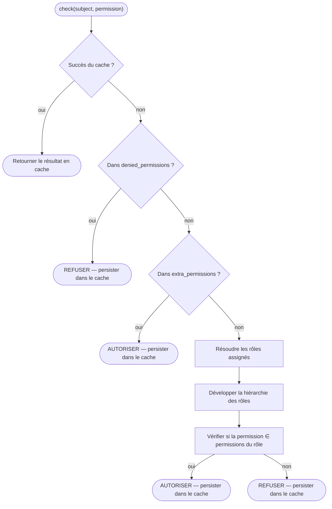
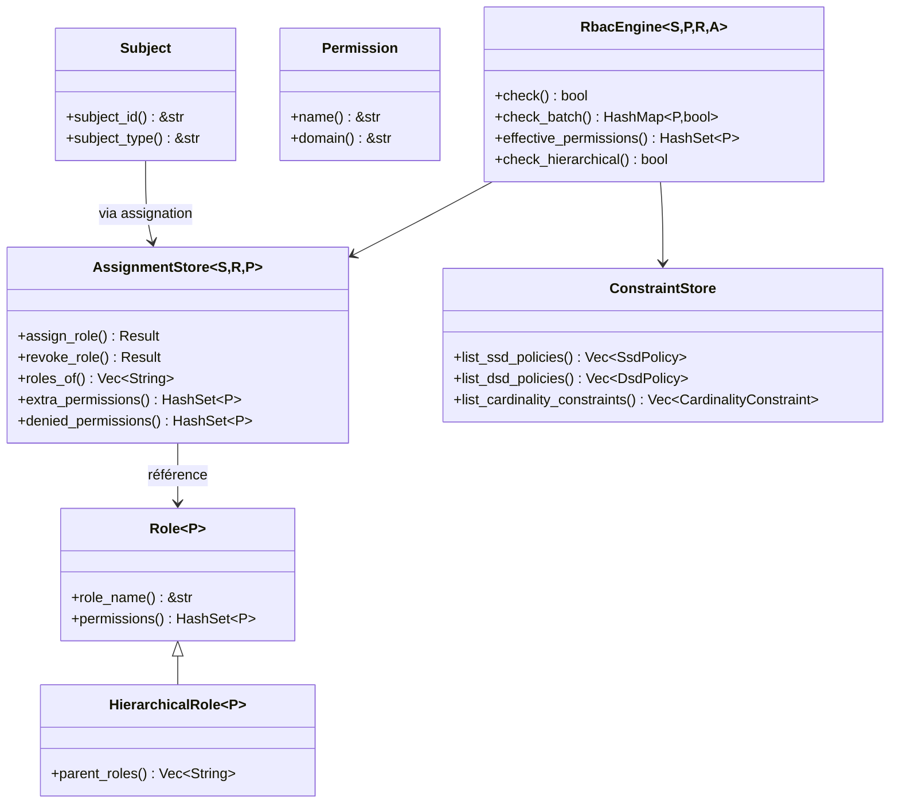

# Concepts Fondamentaux RBAC

## Qu'est-ce que RBAC ?

Le Contrôle d'Accès Basé sur les Rôles (RBAC) est un modèle d'autorisation qui assigne des permissions aux rôles, et des rôles aux utilisateurs (sujets). Cette indirection simplifie la gestion des permissions à grande échelle — au lieu d'accorder des permissions à chaque utilisateur individuellement, vous les assignez à un rôle.

## Entités Principales

### Sujet (Subject)

Un **Sujet** est toute entité pouvant recevoir des permissions — typiquement un utilisateur, un compte de service ou un agent automatisé. Dans kirino, les sujets implémentent le trait `Subject` :

| Trait | Objectif |
|-------|---------|
| `Subject` | Trait de base pour toute entité autorisable |
| `Delegatable` | Un sujet qui peut déléguer ses permissions à un autre sujet |

### Permission (Permission)

Une **Permission** est l'unité atomique d'autorisation — une action nommée sur un domaine de ressource :

| Trait | Objectif |
|-------|---------|
| `Permission` | `name() -> &str` pour la sérialisation, `domain() -> &str` pour le regroupement |

### Rôle (Role)

Un **Rôle** est une collection nommée de permissions :

| Trait | Objectif |
|-------|---------|
| `Role<P>` | Rôle de base : détient un ensemble de permissions |
| `HierarchicalRole<P>` | Étend `Role<P>`, ajoute `parent_roles()` pour l'héritage |

## Niveaux RBAC

Kirino implémente les trois niveaux de la norme ANSI INCITS 359-2004 :



### RBAC0 — Modèle de Base

La fondation : les utilisateurs sont assignés aux rôles, les rôles contiennent des permissions.

```
Sujet ──assigné──→ Rôle ──contient──→ Permission
```

- Un utilisateur avec le rôle "editor" obtient toutes les permissions du rôle "editor".
- Sémantique de refus prioritaire : `denied_permissions` a priorité sur les permissions accordées.
- Permissions supplémentaires : élévation temporaire sans changer l'assignation de rôle.

### RBAC1 — Modèle Hiérarchique

Les rôles peuvent **hériter** des rôles parents, formant un arbre de permissions :



- Les rôles enfants héritent de toutes les permissions des parents (sémantique d'union).
- La détection de cycles empêche les boucles infinies lors de la résolution d'héritage.
- Héritage multiple supporté : un rôle peut avoir plusieurs parents.

### RBAC2 — Modèle de Contraintes

Les contraintes imposent la séparation des tâches et d'autres règles métier :

#### Séparation Statique des Tâches (SSD)

Les rôles conflictuels **ne peuvent pas être assignés** au même utilisateur.

```
SsdPolicy { roles: {"billing", "auditor"}, cardinality: 2 }
→ Un utilisateur ne peut pas détenir simultanément "billing" et "auditor".
```

#### Séparation Dynamique des Tâches (DSD)

Les rôles conflictuels **peuvent être assignés** mais **ne peuvent pas être actifs** dans la même session.

```
DsdPolicy { roles: {"author", "reviewer"}, cardinality: 2 }
→ Un utilisateur peut être author et reviewer, mais n'activer qu'un seul par session.
```

#### Contrainte de Cardinalité

Limite le nombre d'utilisateurs pouvant détenir un rôle donné.

```
CardinalityConstraint { role: "admin", max: 3 }
→ Au maximum 3 utilisateurs peuvent être administrateurs.
```

#### Contrainte de Prérequis

Un utilisateur doit détenir le rôle A avant de se voir attribuer le rôle B.

```
PrerequisiteConstraint { role: "operator", requires: "viewer" }
→ Seuls les viewer existants peuvent être promus operator.
```

#### Contrainte Temporelle

Un rôle n'est valide que dans une fenêtre temporelle.

```
TemporalConstraint { role: "temp-admin", valid_from: ..., valid_until: ... }
→ Expire automatiquement ; révoqué automatiquement après valid_until.
```

## Flux de Décision

Lorsque `RbacEngine::check(subject, permission)` est appelé :



Sémantique clé : **le refus est prioritaire**. Une permission refusée ne peut pas être accordée par des rôles ou des permissions supplémentaires.

## Résumé des Traits Clés


