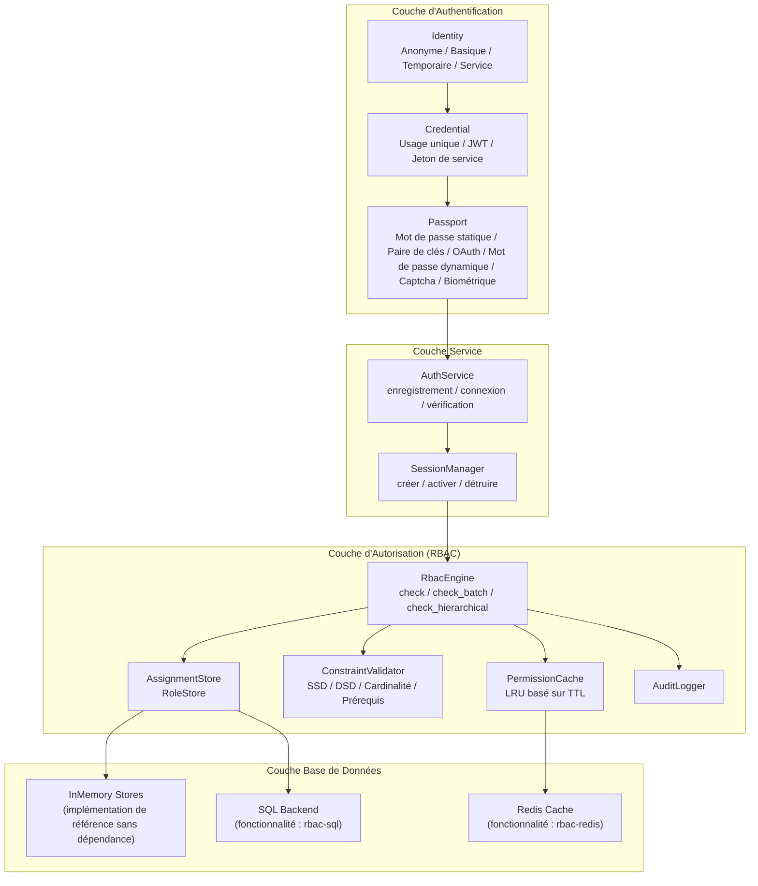
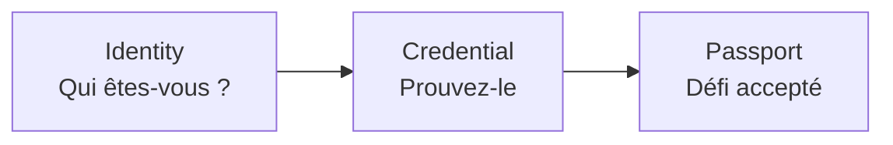
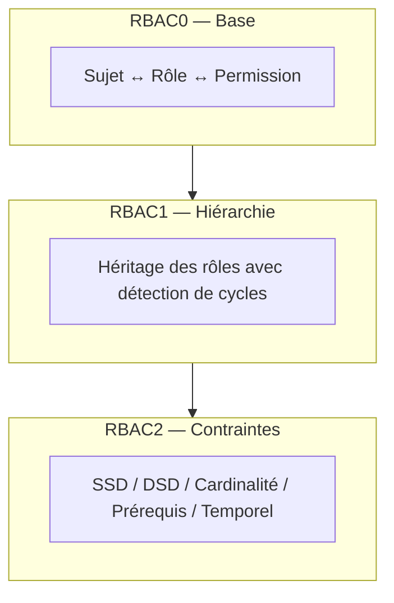
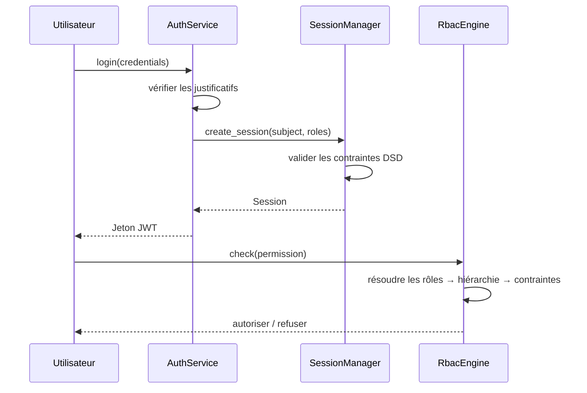

# Vue d'Ensemble du Système

Kirino est un framework d'authentification et d'autorisation en couches. Chaque couche s'appuie sur la couche inférieure, avec des limites de trait claires pour la personnalisation.

## Couche d'Authentification

Kirino authentifie les utilisateurs via un pipeline en trois étapes :

### Types d'Identité

| Type | Description |
|------|-------------|
| **Anonymous (Anonyme)** | Visiteur non authentifié, permissions minimales |
| **Basic (Basique)** | Utilisateur standard, commence avec des permissions minimales |
| **Temporary (Temporaire)** | Compte à durée limitée, expire automatiquement |
| **Service** | Compte de service pour la délégation de permissions |

### Types de Justificatif

| Type | Description |
|------|-------------|
| **OneTimeToken** | Jeton à usage unique, consommé à la première utilisation |
| **Basic (JWT)** | JSON Web Token avec revendications et expiration |
| **ServiceToken** | Jeton longue durée pour les comptes de service |

### Types de Passeport (Défi)

| Type | Description |
|------|-------------|
| **StaticPassword** | Mot de passe vérifié via argon2 |
| **KeyPair** | Vérification de clé SSH ou certificat TLS |
| **OAuth** | Fournisseur OAuth tiers |
| **DynamicPassword** | TOTP/HOTP, code par email, code SMS |
| **Captcha** | reCAPTCHA ou détection de bots similaire |
| **Biological** | Empreinte digitale, voix, reconnaissance faciale |
| **TemporaryWhitelist** | Entrée temporaire en liste blanche |

## Couche d'Autorisation

Le moteur RBAC suit la norme ANSI INCITS 359-2004 et implémente les trois niveaux RBAC :

### Principes de Conception Fondamentaux

1. **Entièrement générique** : Les projets consommateurs définissent leurs propres types `Permission` et `Subject` via des traits.
2. **Sémantique de refus prioritaire** : Les permissions refusées ont toujours la priorité.
3. **Mémoire d'abord** : Tous les backends ont des implémentations de référence sans dépendance.
4. **En couches** : RBAC0/1/2 sont implémentés comme des blocs impl séparés sur `RbacEngine`.
5. **Conscient du cache** : Les vérifications de permissions sont mises en cache avec TTL pour les performances.

## Gestion des Sessions

Les sessions relient l'authentification et l'autorisation :

## Par Où Commencer

- **Démarrage rapide** : Voir le [Guide de Démarrage Rapide](../guides/quick-start.md) pour une configuration minimale.
- **Concepts RBAC** : Voir [Concepts Fondamentaux RBAC](../guides/concepts.md) pour la théorie détaillée.
- **Installation** : Voir le [Guide d'Installation](../guides/installation.md) pour les drapeaux et dépendances.
- **Glossaire** : Voir le [Glossaire](../guides/glossary.md) pour les définitions des termes clés.
