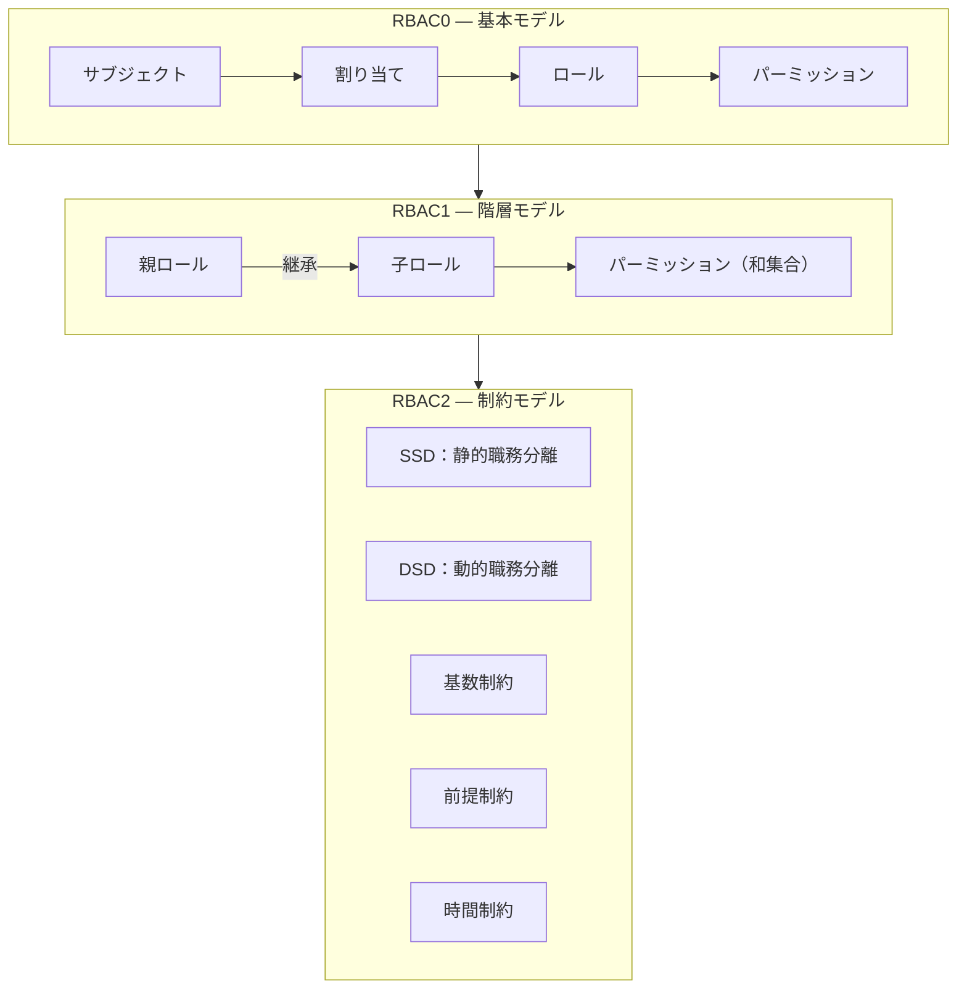
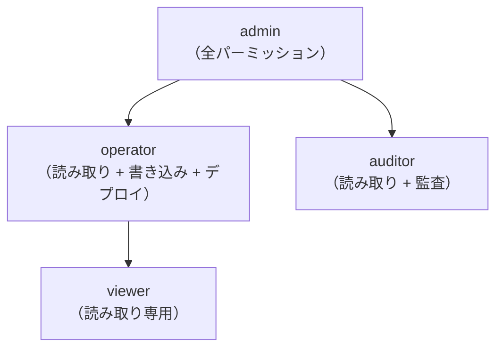
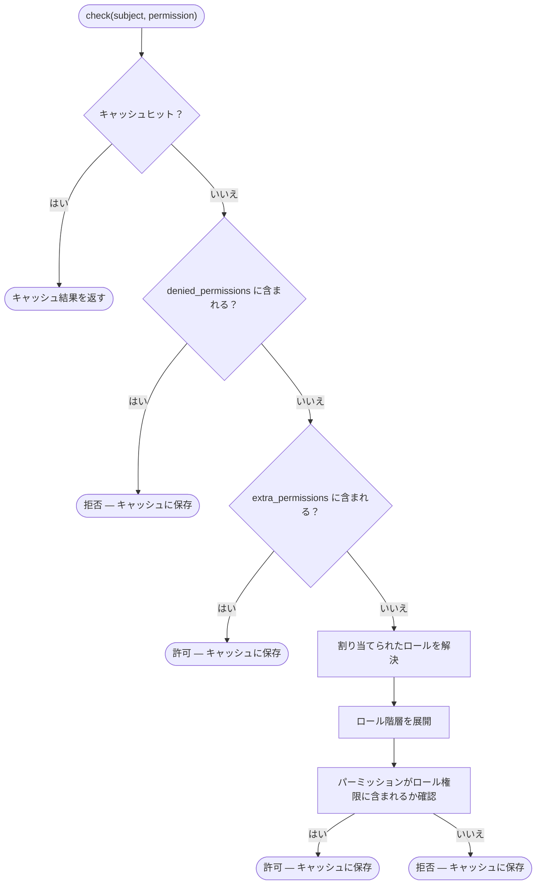
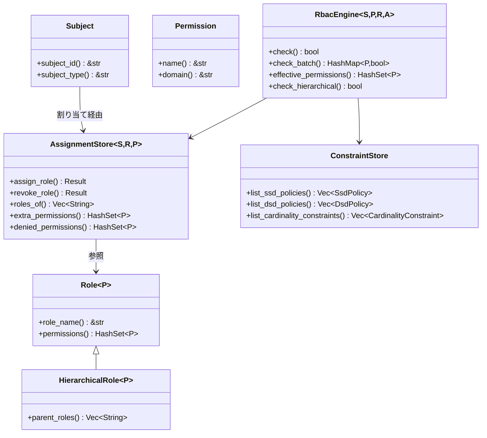

# RBAC コアコンセプト

## RBAC とは？

ロールベースアクセス制御（RBAC）は、パーミッションをロールに割り当て、ロールをユーザー（サブジェクト）に割り当てる認可モデルです。この間接的なマッピングにより、大規模なパーミッション管理が簡素化されます——各ユーザーに個別にパーミッションを付与する代わりに、ロールに割り当てます。

## コアエンティティ

### サブジェクト (Subject)

**サブジェクト** は、パーミッションを付与できる任意のエンティティです——通常はユーザー、サービスアカウント、または自動化エージェントです。kirino では、サブジェクトは `Subject` trait を実装します：

| Trait | 目的 |
|-------|---------|
| `Subject` | 認可可能なエンティティの基本 trait |
| `Delegatable` | 自身のパーミッションを他のサブジェクトに委譲できるサブジェクト |

### パーミッション (Permission)

**パーミッション** は認可の最小単位です——リソースドメインに対する名前付き操作：

| Trait | 目的 |
|-------|---------|
| `Permission` | `name() -> &str`（シリアライゼーション用）、`domain() -> &str`（グループ化用） |

### ロール (Role)

**ロール** はパーミッションの名前付きコレクションです：

| Trait | 目的 |
|-------|---------|
| `Role<P>` | 基本ロール：パーミッションのセットを保持 |
| `HierarchicalRole<P>` | `Role<P>` を拡張し、継承のための `parent_roles()` を追加 |

## RBAC レベル

Kirino は ANSI INCITS 359-2004 標準の 3 つのレベルを実装しています：



### RBAC0 — 基本モデル

基盤：ユーザーはロールに割り当てられ、ロールはパーミッションを保持します。

```
サブジェクト ──割り当て──→ ロール ──含む──→ パーミッション
```

- "editor" ロールを持つユーザーは、"editor" ロール内のすべてのパーミッションを取得します。
- 拒否優先セマンティクス：`denied_permissions` は付与されたパーミッションより優先されます。
- 追加パーミッション：ロール割り当てを変更せずに一時的な権限昇格が可能です。

### RBAC1 — 階層モデル

ロールは親ロールから**継承**でき、パーミッションツリーを形成します：



- 子ロールは親ロールのすべてのパーミッションを継承します（和集合セマンティクス）。
- 循環検出が継承解決時の無限ループを防止します。
- 多重継承をサポート：1 つのロールが複数の親を持つことができます。

### RBAC2 — 制約モデル

制約は職務分離やその他のビジネスルールを強制します：

#### 静的職務分離 (SSD)

競合するロールは**同じユーザーに割り当てられません**。

```
SsdPolicy { roles: {"billing", "auditor"}, cardinality: 2 }
→ ユーザーは "billing" と "auditor" を同時に保持できません。
```

#### 動的職務分離 (DSD)

競合するロールは**割り当て可能**ですが、**同じセッションでアクティブにできません**。

```
DsdPolicy { roles: {"author", "reviewer"}, cardinality: 2 }
→ ユーザーは author と reviewer の両方になれますが、セッションごとに 1 つだけアクティブにできます。
```

#### 基数制約

特定のロールを保持できるユーザー数を制限します。

```
CardinalityConstraint { role: "admin", max: 3 }
→ 最大 3 ユーザーが管理者になれます。
```

#### 前提制約

ユーザーはロール B を割り当てられる前にロール A を保持している必要があります。

```
PrerequisiteConstraint { role: "operator", requires: "viewer" }
→ 既存の viewer のみが operator に昇格できます。
```

#### 時間制約

ロールは時間枠内でのみ有効です。

```
TemporalConstraint { role: "temp-admin", valid_from: ..., valid_until: ... }
→ 自動失効；valid_until を過ぎると自動的に取り消されます。
```

## 決定フロー

`RbacEngine::check(subject, permission)` が呼び出されたとき：



重要なセマンティクス：**拒否優先**。拒否されたパーミッションはロールや追加パーミッションによって付与できません。

## 主要 Trait 概要


