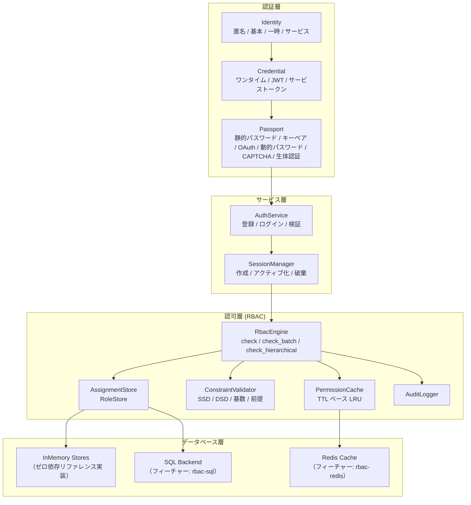
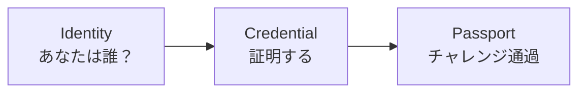
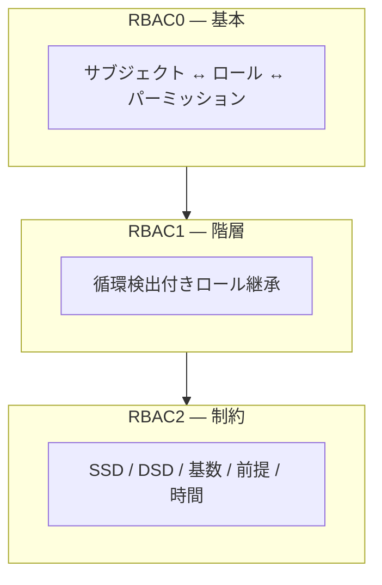
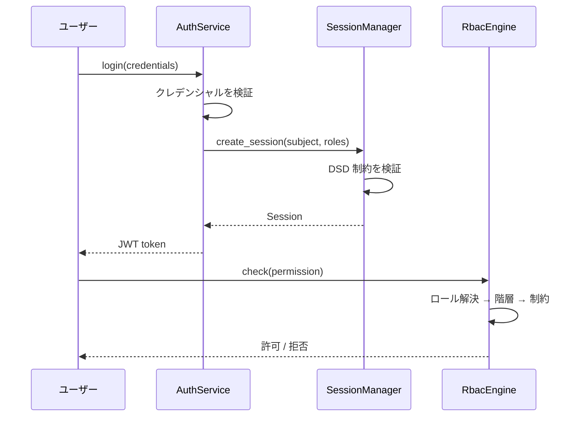

# システム概要

Kirino は階層化された認証・認可フレームワークです。各レイヤーは下位レイヤーの上に構築され、明確な trait 境界によるカスタマイズを可能にします。

## 認証層

Kirino は 3 ステップのパイプラインでユーザーを認証します：

### アイデンティティタイプ

| タイプ | 説明 |
|------|-------------|
| **Anonymous（匿名）** | 未認証の訪問者、最小限のパーミッション |
| **Basic（基本）** | 標準ユーザー、最小限のパーミッションから開始 |
| **Temporary（一時）** | 期間限定アカウント、自動失効 |
| **Service（サービス）** | パーミッション委譲用のサービスアカウント |

### クレデンシャルタイプ

| タイプ | 説明 |
|------|-------------|
| **OneTimeToken** | ワンタイムトークン、初回使用で消費 |
| **Basic (JWT)** | クレームと有効期限付きの JSON Web Token |
| **ServiceToken** | サービスアカウント用の長期トークン |

### パスポート（チャレンジ）タイプ

| タイプ | 説明 |
|------|-------------|
| **StaticPassword** | argon2 で検証されるパスワード |
| **KeyPair** | SSH キーまたは TLS 証明書検証 |
| **OAuth** | サードパーティ OAuth プロバイダー |
| **DynamicPassword** | TOTP/HOTP、メールコード、SMS コード |
| **Captcha** | reCAPTCHA または類似のボット検出 |
| **Biological** | 指紋、声紋、顔認識 |
| **TemporaryWhitelist** | 期間限定ホワイトリストエントリ |

## 認可層

RBAC エンジンは ANSI INCITS 359-2004 標準に従い、3 つの RBAC レベルすべてを実装しています：

### コアデザイン原則

1. **完全にジェネリック**：下流プロジェクトが trait を通じて独自の `Permission` と `Subject` 型を定義。
2. **拒否優先セマンティクス**：拒否されたパーミッションが常に優先。
3. **インメモリファースト**：すべてのバックエンドにゼロ依存のリファレンス実装を提供。
4. **階層化**：RBAC0/1/2 を `RbacEngine` 上の個別の impl ブロックとして階層化。
5. **キャッシュ対応**：パーミッションチェックは TTL でキャッシュされパフォーマンスを向上。

## セッション管理

セッションは認証と認可をつなぎます：

## どこから始めるか

- **クイックスタート**：最小構成は [クイックスタートガイド](../guides/quick-start.md) を参照。
- **RBAC 概念**：詳細な RBAC 理論は [RBAC コアコンセプト](../guides/concepts.md) を参照。
- **インストール**：フィーチャーフラグと依存関係は [インストールガイド](../guides/installation.md) を参照。
- **用語集**：主要用語の定義は [用語集](../guides/glossary.md) を参照。
