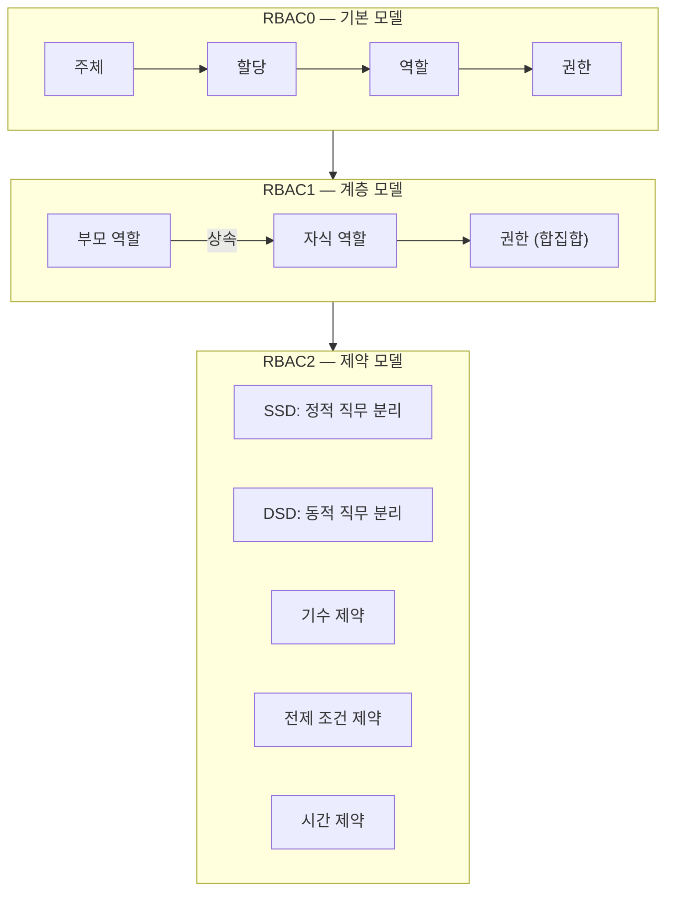
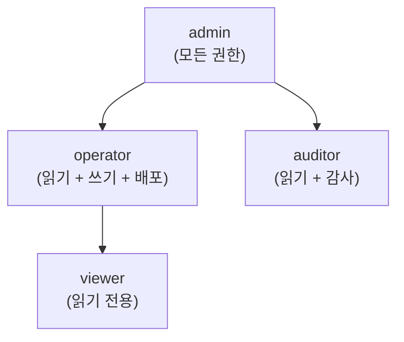
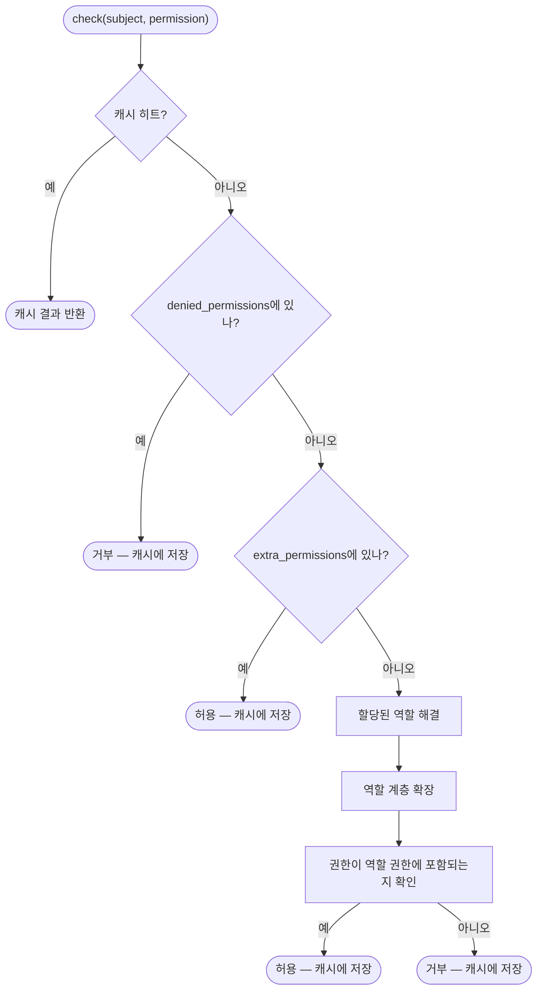
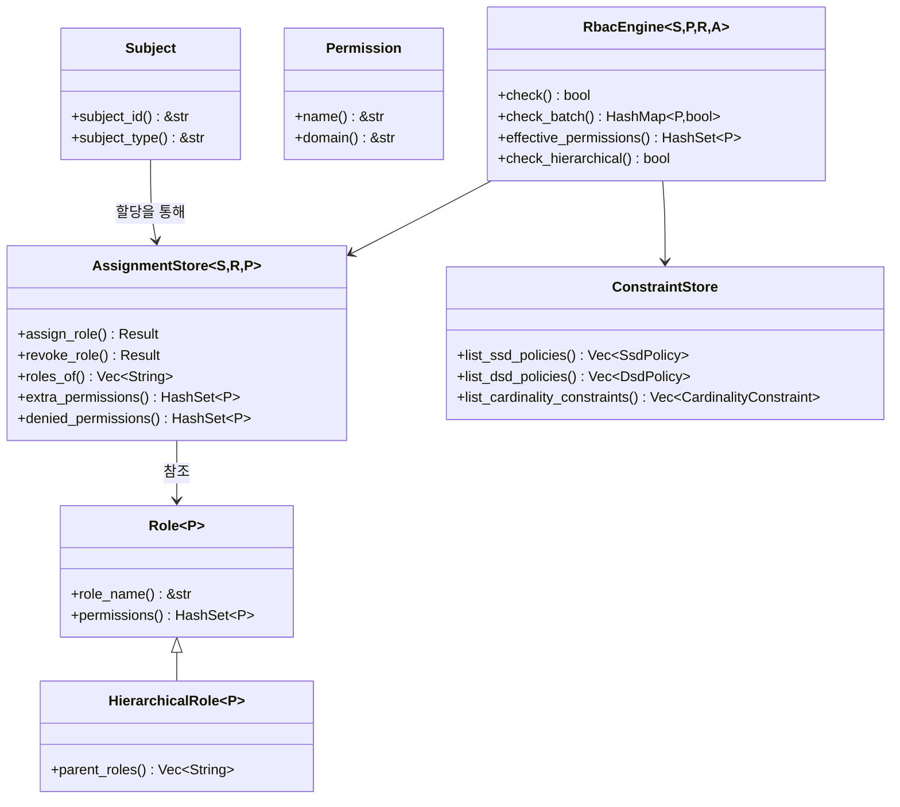

# RBAC 핵심 개념

## RBAC란?

역할 기반 접근 제어(RBAC)는 권한을 역할에 할당하고, 역할을 사용자(주체)에 할당하는 권한 부여 모델입니다. 이 간접 매핑은 대규모 권한 관리를 단순화합니다——각 사용자에게 개별적으로 권한을 부여하는 대신 역할에 할당합니다.

## 핵심 엔티티

### 주체 (Subject)

**주체**는 권한을 부여받을 수 있는 모든 엔티티입니다——일반적으로 사용자, 서비스 계정, 자동화 에이전트입니다. kirino에서 주체는 `Subject` trait를 구현합니다:

| Trait | 목적 |
|-------|---------|
| `Subject` | 모든 권한 부여 가능 엔티티의 기본 trait |
| `Delegatable` | 자신의 권한을 다른 주체에 위임할 수 있는 주체 |

### 권한 (Permission)

**권한**은 권한 부여의 최소 단위입니다——리소스 도메인에 대한 이름 지정 작업:

| Trait | 목적 |
|-------|---------|
| `Permission` | `name() -> &str` (직렬화용), `domain() -> &str` (그룹화용) |

### 역할 (Role)

**역할**은 권한의 이름 지정 컬렉션입니다:

| Trait | 목적 |
|-------|---------|
| `Role<P>` | 기본 역할: 권한 집합 보유 |
| `HierarchicalRole<P>` | `Role<P>` 확장, 상속을 위한 `parent_roles()` 추가 |

## RBAC 수준

Kirino는 ANSI INCITS 359-2004 표준의 세 가지 수준을 구현합니다:



### RBAC0 — 기본 모델

기반: 사용자가 역할에 할당되고, 역할은 권한을 보유합니다.

```
주체 ──할당──→ 역할 ──포함──→ 권한
```

- "editor" 역할을 가진 사용자는 "editor" 역할의 모든 권한을 얻습니다.
- 거부 우선 의미: `denied_permissions`는 부여된 권한보다 우선합니다.
- 추가 권한: 역할 할당을 변경하지 않고 일시적 권한 상승.

### RBAC1 — 계층 모델

역할은 부모 역할로부터 **상속**하여 권한 트리를 형성할 수 있습니다:



- 자식 역할은 부모 역할의 모든 권한을 상속합니다 (합집합 의미).
- 순환 감지가 상속 해결 중 무한 루프를 방지합니다.
- 다중 상속 지원: 하나의 역할이 여러 부모를 가질 수 있습니다.

### RBAC2 — 제약 모델

제약은 직무 분리 및 기타 비즈니스 규칙을 강제합니다:

#### 정적 직무 분리 (SSD)

충돌하는 역할은 **동일 사용자에게 할당될 수 없습니다**.

```
SsdPolicy { roles: {"billing", "auditor"}, cardinality: 2 }
→ 사용자가 "billing"과 "auditor"를 동시에 보유할 수 없습니다.
```

#### 동적 직무 분리 (DSD)

충돌하는 역할은 **할당 가능**하나 **동일 세션에서 활성화될 수 없습니다**.

```
DsdPolicy { roles: {"author", "reviewer"}, cardinality: 2 }
→ 사용자가 author와 reviewer 모두 가능하지만 세션당 하나만 활성화.
```

#### 기수 제약

특정 역할을 보유할 수 있는 사용자 수를 제한합니다.

```
CardinalityConstraint { role: "admin", max: 3 }
→ 최대 3명의 사용자가 관리자 가능.
```

#### 전제 조건 제약

사용자가 역할 B를 할당받기 전에 역할 A를 보유해야 합니다.

```
PrerequisiteConstraint { role: "operator", requires: "viewer" }
→ 기존 viewer만 operator로 승격 가능.
```

#### 시간 제약

역할은 시간 창 내에서만 유효합니다.

```
TemporalConstraint { role: "temp-admin", valid_from: ..., valid_until: ... }
→ 자동 만료; valid_until 이후 자동 취소.
```

## 결정 흐름

`RbacEngine::check(subject, permission)` 호출 시:



핵심 의미: **거부 우선**. 거부된 권한은 역할이나 추가 권한으로 부여할 수 없습니다.

## 주요 Trait 개요


