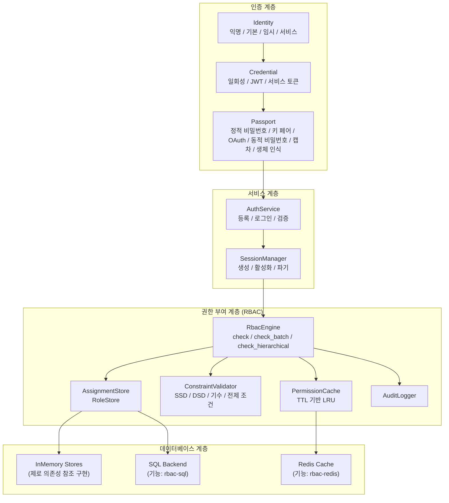
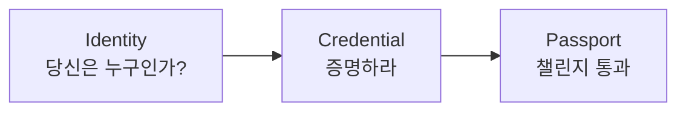
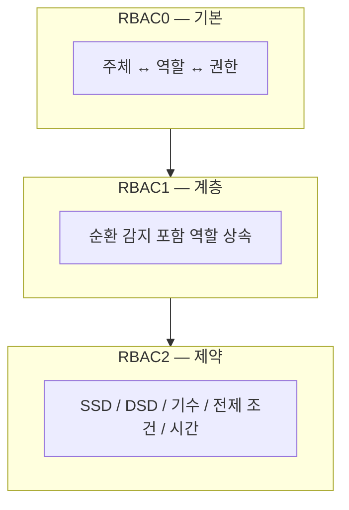
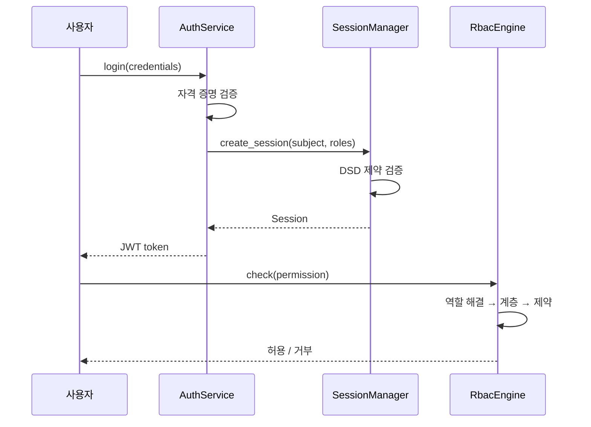

# 시스템 개요

Kirino는 계층화된 인증 및 권한 부여 프레임워크입니다. 각 계층은 하위 계층 위에 구축되며, 명확한 trait 경계를 통한 커스터마이징이 가능합니다.

## 인증 계층

Kirino는 3단계 파이프라인으로 사용자를 인증합니다:

### 아이덴티티 유형

| 유형 | 설명 |
|------|-------------|
| **Anonymous（익명）** | 인증되지 않은 방문자, 최소 권한 |
| **Basic（기본）** | 표준 사용자, 최소 권한으로 시작 |
| **Temporary（임시）** | 기간 한정 계정, 자동 만료 |
| **Service（서비스）** | 권한 위임용 서비스 계정 |

### 자격 증명 유형

| 유형 | 설명 |
|------|-------------|
| **OneTimeToken** | 일회성 토큰, 첫 사용 시 소비 |
| **Basic (JWT)** | 클레임과 만료 시간이 있는 JSON Web Token |
| **ServiceToken** | 서비스 계정용 장기 토큰 |

### 패스포트 (챌린지) 유형

| 유형 | 설명 |
|------|-------------|
| **StaticPassword** | argon2로 검증되는 비밀번호 |
| **KeyPair** | SSH 키 또는 TLS 인증서 검증 |
| **OAuth** | 서드파티 OAuth 제공자 |
| **DynamicPassword** | TOTP/HOTP, 이메일 코드, SMS 코드 |
| **Captcha** | reCAPTCHA 또는 유사 봇 감지 |
| **Biological** | 지문, 음성, 안면 인식 |
| **TemporaryWhitelist** | 기간 한정 화이트리스트 항목 |

## 권한 부여 계층

RBAC 엔진은 ANSI INCITS 359-2004 표준을 따르며 세 가지 RBAC 수준을 모두 구현합니다:

### 핵심 설계 원칙

1. **완전 제네릭**: 하위 프로젝트가 trait를 통해 자체 `Permission` 및 `Subject` 유형 정의.
2. **거부 우선 의미**: 거부된 권한이 항상 우선.
3. **인메모리 우선**: 모든 백엔드에 제로 의존성 참조 구현 제공.
4. **계층화**: RBAC0/1/2가 `RbacEngine`의 개별 impl 블록으로 계층화.
5. **캐시 인식**: 권한 확인이 TTL로 캐시되어 성능 향상.

## 세션 관리

세션은 인증과 권한 부여를 연결합니다:

## 시작점

- **빠른 시작**: 최소 설정은 [빠른 시작 가이드](../guides/quick-start.md) 참조.
- **RBAC 개념**: 상세 RBAC 이론은 [RBAC 핵심 개념](../guides/concepts.md) 참조.
- **설치**: 기능 플래그와 의존성은 [설치 가이드](../guides/installation.md) 참조.
- **용어집**: 주요 용어 정의는 [용어집](../guides/glossary.md) 참조.
