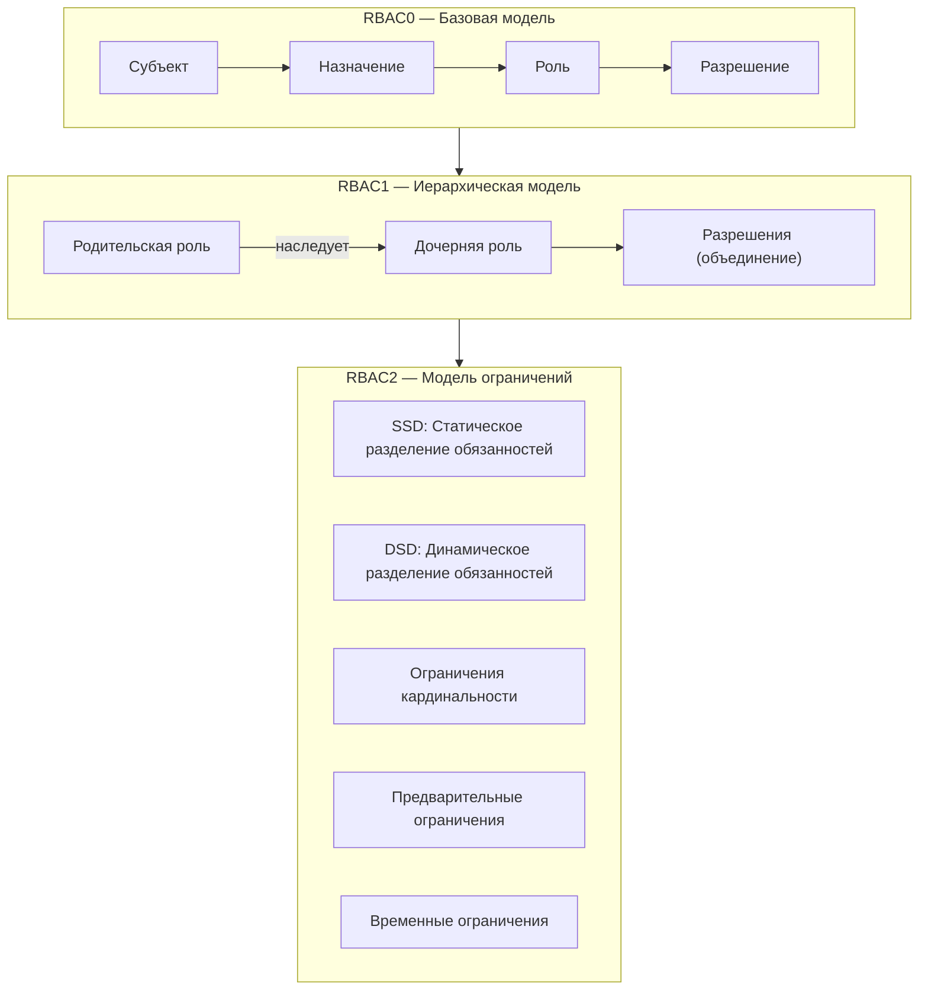
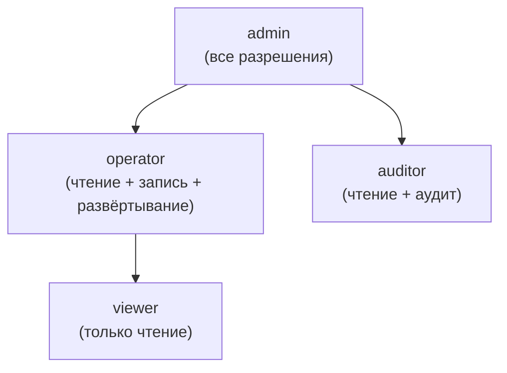
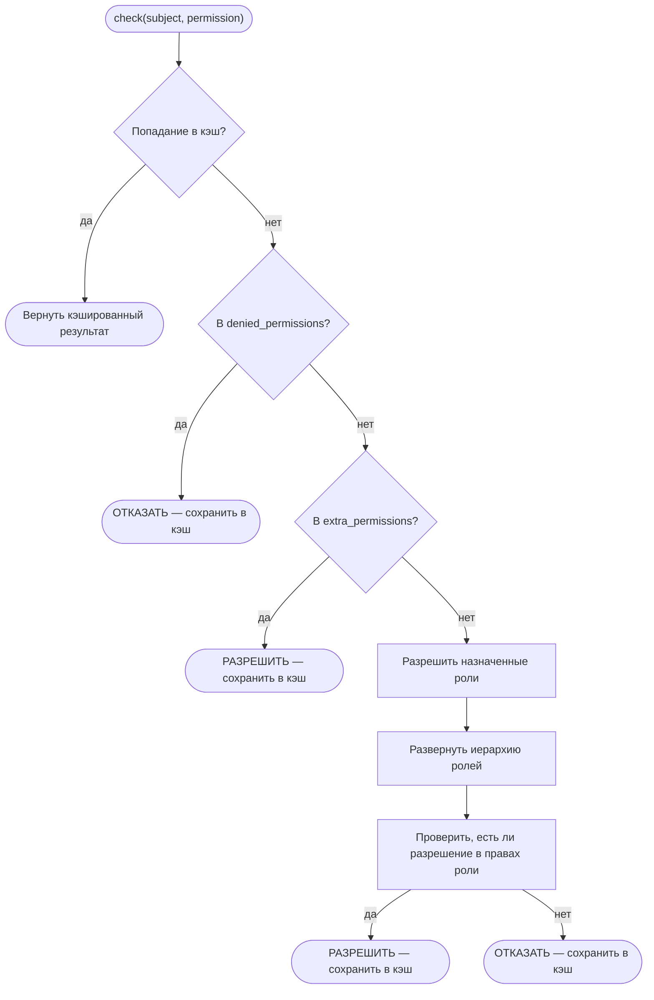
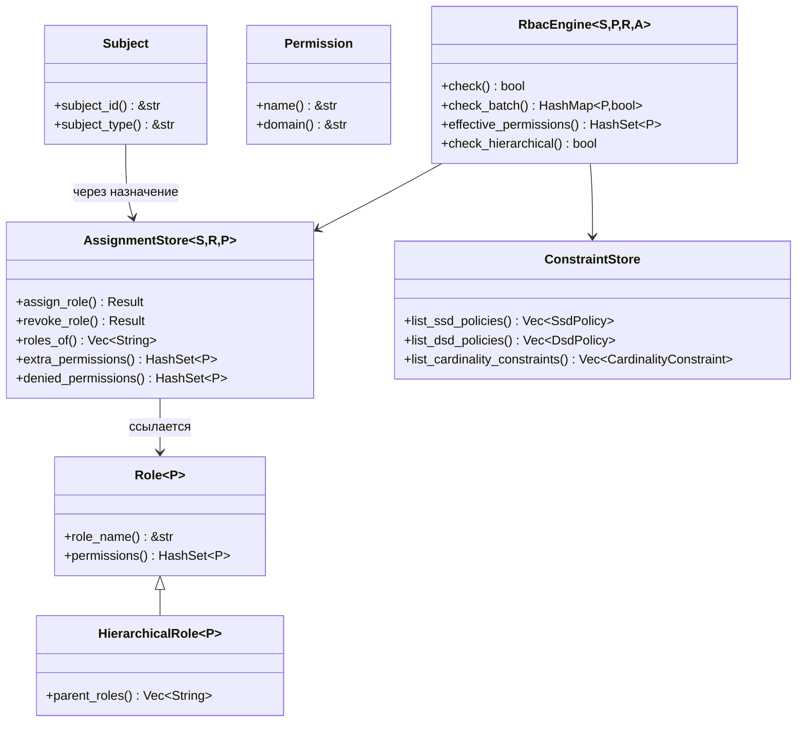

# Основные концепции RBAC

## Что такое RBAC?

Управление доступом на основе ролей (RBAC) — это модель авторизации, которая назначает разрешения ролям, а роли — пользователям (субъектам). Эта косвенная связь упрощает управление разрешениями в масштабе — вместо предоставления разрешений каждому пользователю индивидуально, вы назначаете их роли.

## Основные сущности

### Субъект (Subject)

**Субъект** — это любая сущность, которой могут быть предоставлены разрешения — обычно пользователь, сервисная учётная запись или автоматизированный агент. В kirino субъекты реализуют trait `Subject`:

| Trait | Назначение |
|-------|---------|
| `Subject` | Базовый trait для любой авторизуемой сущности |
| `Delegatable` | Субъект, который может делегировать свои разрешения другому субъекту |

### Разрешение (Permission)

**Разрешение** — это атомарная единица авторизации — именованное действие над доменом ресурса:

| Trait | Назначение |
|-------|---------|
| `Permission` | `name() -> &str` для сериализации, `domain() -> &str` для группировки |

### Роль (Role)

**Роль** — это именованный набор разрешений:

| Trait | Назначение |
|-------|---------|
| `Role<P>` | Базовая роль: содержит набор разрешений |
| `HierarchicalRole<P>` | Расширяет `Role<P>`, добавляет `parent_roles()` для наследования |

## Уровни RBAC

Kirino реализует три уровня стандарта ANSI INCITS 359-2004:



### RBAC0 — Базовая модель

Основа: пользователи назначаются ролям, роли содержат разрешения.

```
Субъект ──назначен──→ Роль ──содержит──→ Разрешение
```

- Пользователь с ролью "editor" получает все разрешения роли "editor".
- Семантика приоритета отказа: `denied_permissions` имеют приоритет над предоставленными.
- Дополнительные разрешения: временное повышение без изменения назначения роли.

### RBAC1 — Иерархическая модель

Роли могут **наследовать** от родительских ролей, образуя дерево разрешений:



- Дочерние роли наследуют все разрешения родителей (семантика объединения).
- Обнаружение циклов предотвращает бесконечные циклы при разрешении наследования.
- Поддержка множественного наследования: роль может иметь несколько родителей.

### RBAC2 — Модель ограничений

Ограничения обеспечивают разделение обязанностей и другие бизнес-правила:

#### Статическое разделение обязанностей (SSD)

Конфликтующие роли **не могут быть назначены** одному пользователю.

```
SsdPolicy { roles: {"billing", "auditor"}, cardinality: 2 }
→ Пользователь не может одновременно иметь "billing" и "auditor".
```

#### Динамическое разделение обязанностей (DSD)

Конфликтующие роли **могут быть назначены**, но **не могут быть активны** в одной сессии.

```
DsdPolicy { roles: {"author", "reviewer"}, cardinality: 2 }
→ Пользователь может быть и author, и reviewer, но активировать только одну за сессию.
```

#### Ограничение кардинальности

Ограничивает количество пользователей, которые могут иметь определённую роль.

```
CardinalityConstraint { role: "admin", max: 3 }
→ Не более 3 пользователей могут быть администраторами.
```

#### Предварительное ограничение

Пользователь должен иметь роль A перед назначением роли B.

```
PrerequisiteConstraint { role: "operator", requires: "viewer" }
→ Только существующие viewer могут быть повышены до operator.
```

#### Временное ограничение

Роль действительна только в течение временного окна.

```
TemporalConstraint { role: "temp-admin", valid_from: ..., valid_until: ... }
→ Автоматически истекает; автоматически отзывается после valid_until.
```

## Процесс принятия решения

При вызове `RbacEngine::check(subject, permission)`:



Ключевая семантика: **приоритет отказа**. Отказанное разрешение не может быть предоставлено через роли или дополнительные разрешения.

## Обзор ключевых Trait


