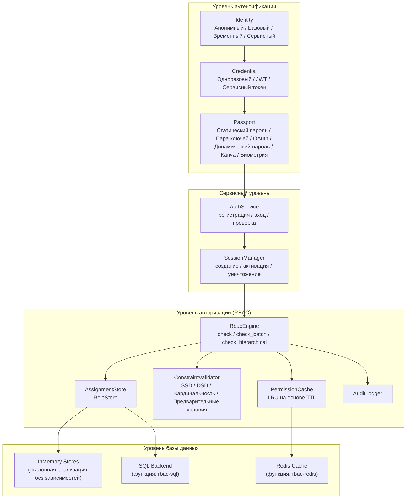
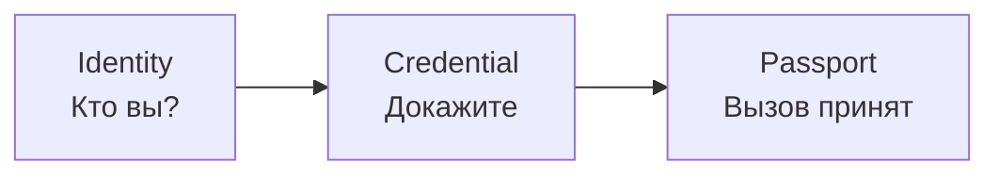
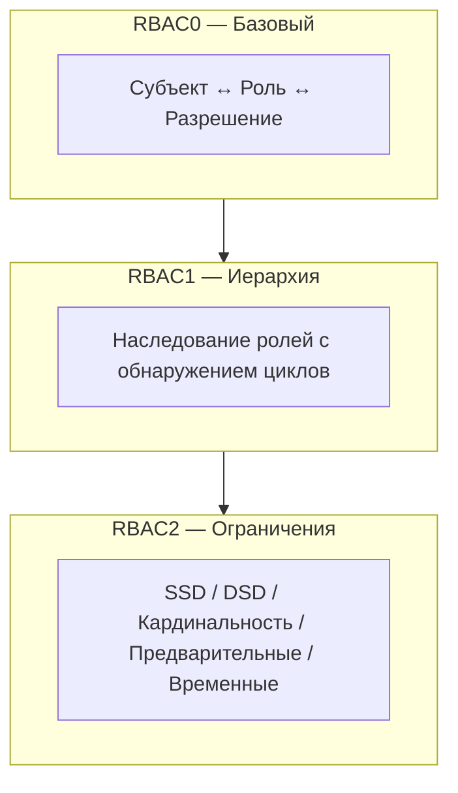
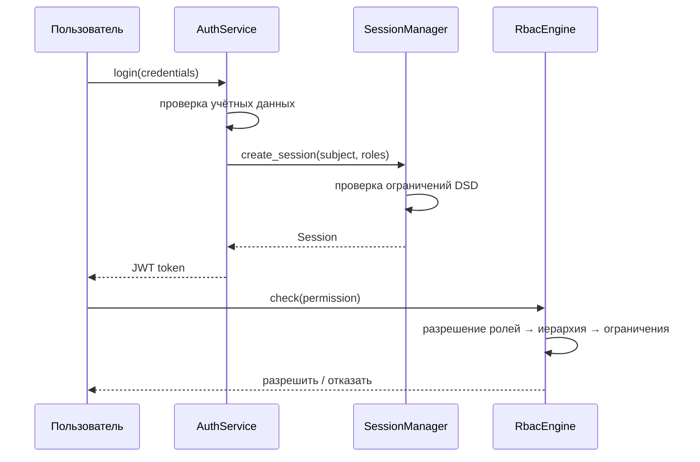

# Обзор системы

Kirino — это многоуровневый фреймворк аутентификации и авторизации. Каждый уровень строится на нижележащем, с чёткими границами trait для настройки.

## Уровень аутентификации

Kirino аутентифицирует пользователей через трёхшаговый конвейер:

### Типы идентичности

| Тип | Описание |
|------|-------------|
| **Anonymous (Анонимный)** | Неаутентифицированный посетитель, минимальные разрешения |
| **Basic (Базовый)** | Стандартный пользователь, начинает с минимальных разрешений |
| **Temporary (Временный)** | Учётная запись с ограниченным сроком, автоматически истекает |
| **Service (Сервисный)** | Сервисная учётная запись для делегирования разрешений |

### Типы учётных данных

| Тип | Описание |
|------|-------------|
| **OneTimeToken** | Одноразовый токен, расходуется при первом использовании |
| **Basic (JWT)** | JSON Web Token с утверждениями и сроком действия |
| **ServiceToken** | Долгосрочный токен для сервисных учётных записей |

### Типы паспортов (вызовов)

| Тип | Описание |
|------|-------------|
| **StaticPassword** | Пароль, проверяемый через argon2 |
| **KeyPair** | Проверка SSH-ключа или TLS-сертификата |
| **OAuth** | Сторонний OAuth-провайдер |
| **DynamicPassword** | TOTP/HOTP, код по email, код по SMS |
| **Captcha** | reCAPTCHA или аналогичное обнаружение ботов |
| **Biological** | Отпечаток пальца, голос, распознавание лица |
| **TemporaryWhitelist** | Временная запись в белом списке |

## Уровень авторизации

Движок RBAC следует стандарту ANSI INCITS 359-2004 и реализует все три уровня RBAC:

### Основные принципы проектирования

1. **Полностью обобщённый**: Проекты-потребители определяют свои типы `Permission` и `Subject` через trait.
2. **Семантика приоритета отказа**: Отказанные разрешения всегда имеют приоритет.
3. **Сначала в памяти**: Все бэкенды имеют эталонные реализации без зависимостей.
4. **Многоуровневый**: RBAC0/1/2 реализованы как отдельные блоки impl на `RbacEngine`.
5. **С учётом кэширования**: Проверки разрешений кэшируются с TTL для производительности.

## Управление сессиями

Сессии связывают аутентификацию и авторизацию:

## С чего начать

- **Быстрый старт**: См. [Руководство по быстрому старту](../guides/quick-start.md) для минимальной настройки.
- **Концепции RBAC**: См. [Основные концепции RBAC](../guides/concepts.md) для детальной теории RBAC.
- **Установка**: См. [Руководство по установке](../guides/installation.md) для флагов функций и зависимостей.
- **Глоссарий**: См. [Глоссарий](../guides/glossary.md) для определений ключевых терминов.
