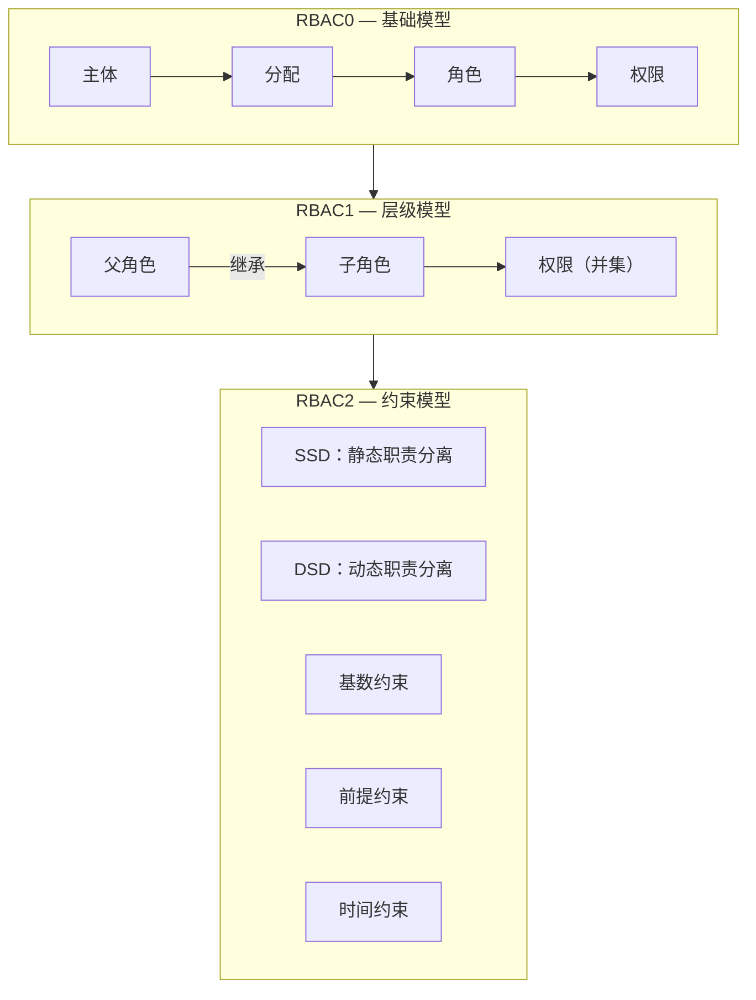
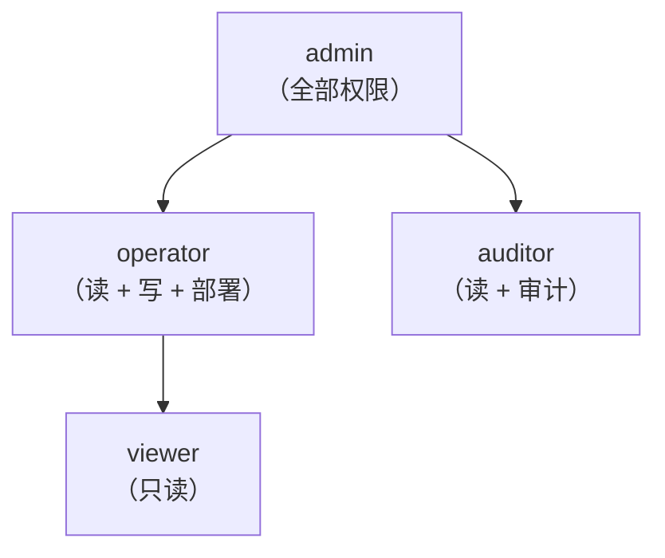
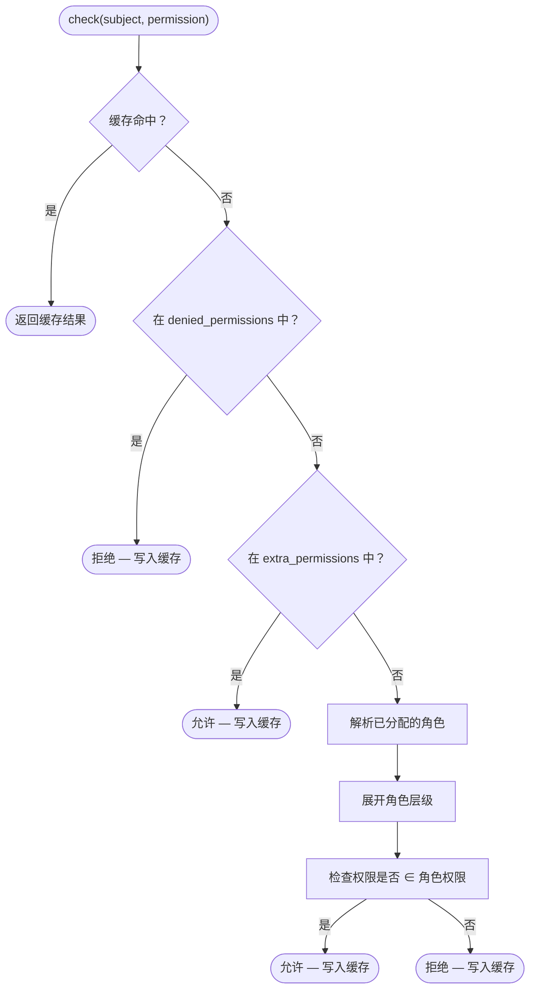
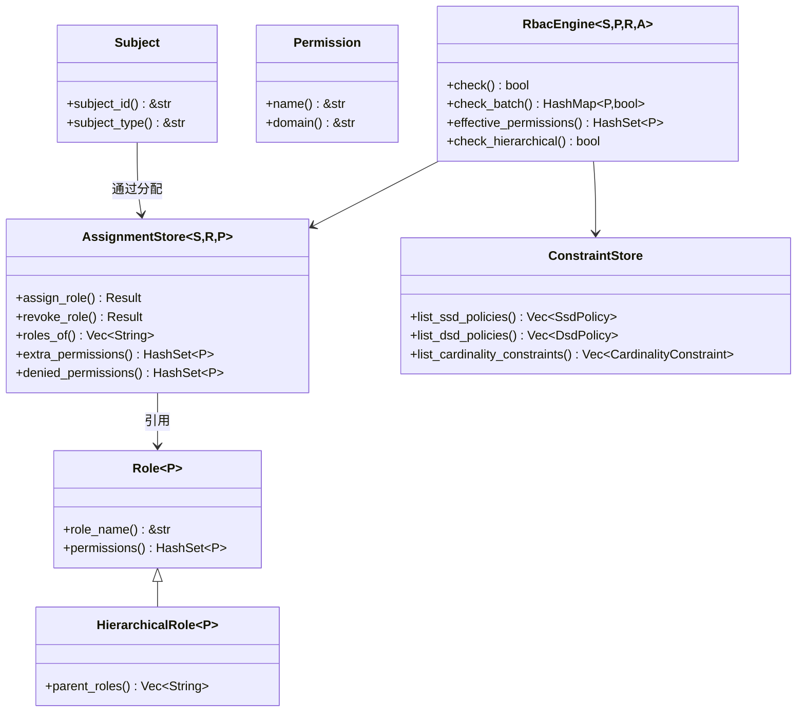

# RBAC 核心概念

## 什么是 RBAC？

基于角色的访问控制（RBAC）是一种授权模型，它将权限分配给角色，再将角色分配给用户（主体）。这种间接映射简化了大规模权限管理——你不再需要为每个用户单独分配权限，而是将其分配给角色。

## 核心实体

### 主体 (Subject)

**主体** 是可以被授予权限的任何实体——通常是用户、服务账户或自动化代理。在 kirino 中，主体需实现 `Subject` trait：

| Trait | 用途 |
|-------|---------|
| `Subject` | 所有可授权实体的基础 trait |
| `Delegatable` | 可将其权限委托给其他主体的主体 |

### 权限 (Permission)

**权限** 是授权的最小单元——一个针对资源域的命名操作：

| Trait | 用途 |
|-------|---------|
| `Permission` | `name() -> &str` 用于序列化，`domain() -> &str` 用于分组 |

### 角色 (Role)

**角色** 是权限的命名集合：

| Trait | 用途 |
|-------|---------|
| `Role<P>` | 基础角色：持有一组权限 |
| `HierarchicalRole<P>` | 扩展 `Role<P>`，增加 `parent_roles()` 以支持继承 |

## RBAC 层级

Kirino 实现了 ANSI INCITS 359-2004 标准的三个层级：



### RBAC0 — 基础模型

基础模型：用户被分配到角色，角色持有权限。

```
主体 ──分配──→ 角色 ──包含──→ 权限
```

- 拥有 "editor" 角色的用户获得 "editor" 角色中的所有权限。
- 拒绝优先语义：`denied_permissions` 优先级高于授予的权限。
- 额外权限：无需更改角色分配即可临时提权。

### RBAC1 — 层级模型

角色可以**继承**父角色，形成权限树：



- 子角色继承父角色的所有权限（并集语义）。
- 循环检测可防止继承解析时的无限循环。
- 支持多重继承：一个角色可以有多个父角色。

### RBAC2 — 约束模型

约束强制实施职责分离和其他业务规则：

#### 静态职责分离 (SSD)

冲突的角色**不能分配给**同一用户。

```
SsdPolicy { roles: {"billing", "auditor"}, cardinality: 2 }
→ 用户不能同时持有 "billing" 和 "auditor"。
```

#### 动态职责分离 (DSD)

冲突的角色**可以分配**但**不能在同一会话中激活**。

```
DsdPolicy { roles: {"author", "reviewer"}, cardinality: 2 }
→ 用户可以是 author 又是 reviewer，但每个会话只能激活一个。
```

#### 基数约束

限制可以持有某个角色的用户数量。

```
CardinalityConstraint { role: "admin", max: 3 }
→ 最多 3 个用户可以是管理员。
```

#### 前提约束

用户必须先持有角色 A 才能被分配角色 B。

```
PrerequisiteConstraint { role: "operator", requires: "viewer" }
→ 只有现有的 viewer 才能被提升为 operator。
```

#### 时间约束

角色仅在时间窗口内有效。

```
TemporalConstraint { role: "temp-admin", valid_from: ..., valid_until: ... }
→ 自动过期；超过 valid_until 后自动撤销。
```

## 决策流程

当调用 `RbacEngine::check(subject, permission)` 时：



关键语义：**拒绝优先**。被拒绝的权限无法通过角色或额外权限授权。

## 核心 Trait 总览


