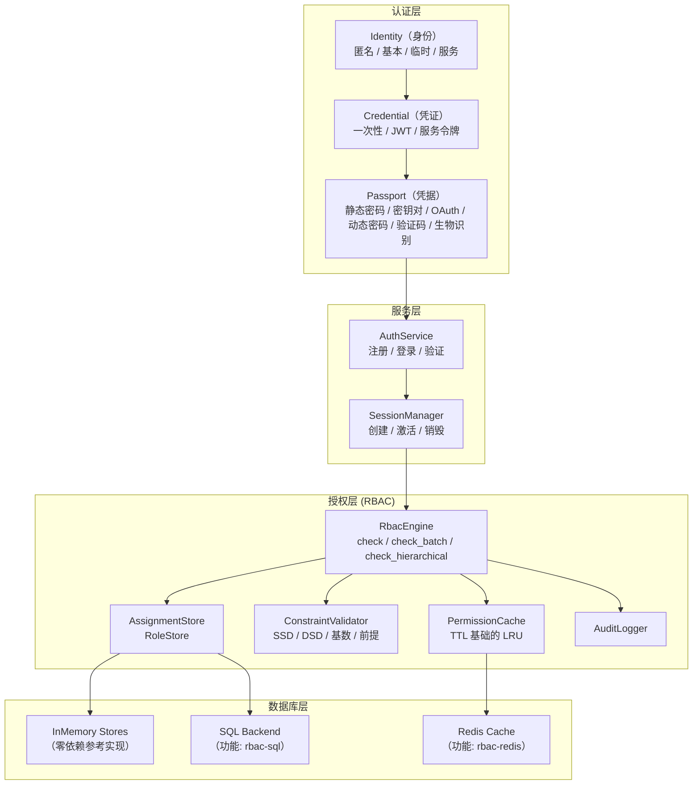
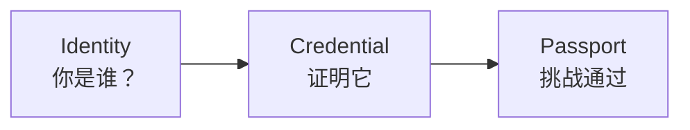
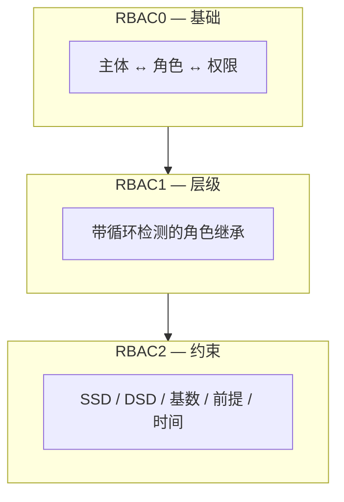
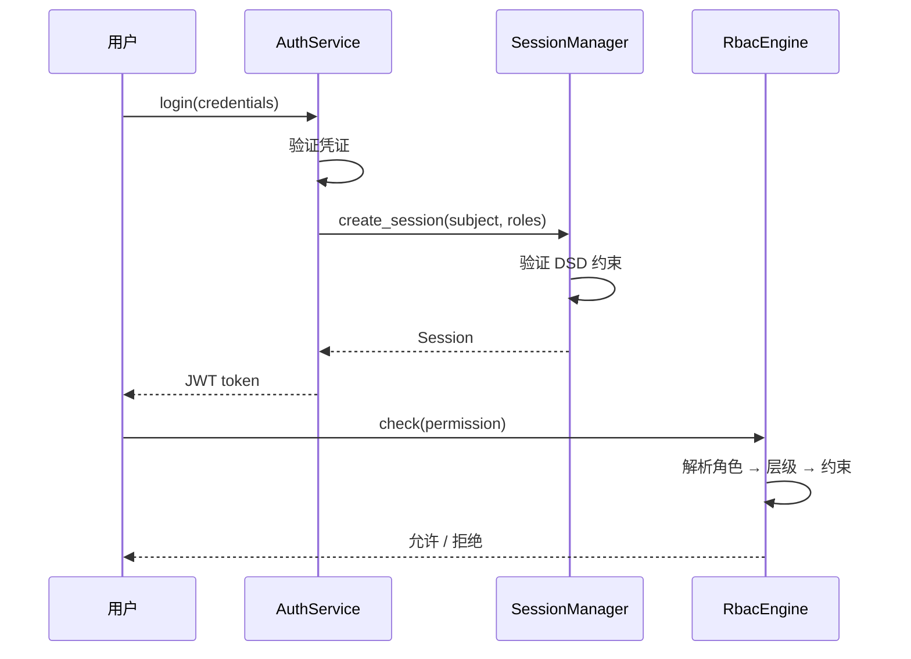

# 系统架构总览

Kirino 是一个分层的认证与授权框架。每一层都建立在下一层之上，并通过清晰的 trait 边界支持定制。

## 认证层

Kirino 通过三步管道对用户进行认证：

### 身份类型

| 类型 | 描述 |
|------|-------------|
| **Anonymous（匿名）** | 未认证访客，最小权限 |
| **Basic（基本）** | 标准用户，初始仅有最小权限 |
| **Temporary（临时）** | 限时账户，自动过期 |
| **Service（服务）** | 用于权限委托的服务账户 |

### 凭证类型

| 类型 | 描述 |
|------|-------------|
| **OneTimeToken** | 一次性令牌，首次使用即消耗 |
| **Basic (JWT)** | 带有声明和过期时间的 JSON Web Token |
| **ServiceToken** | 服务账户的长期令牌 |

### 凭据（挑战）类型

| 类型 | 描述 |
|------|-------------|
| **StaticPassword** | 通过 argon2 验证的密码 |
| **KeyPair** | SSH 密钥或 TLS 证书验证 |
| **OAuth** | 第三方 OAuth 提供方 |
| **DynamicPassword** | TOTP/HOTP、邮箱验证码、短信验证码 |
| **Captcha** | reCAPTCHA 或类似机器人检测 |
| **Biological** | 指纹、声纹、面部识别 |
| **TemporaryWhitelist** | 限时白名单条目 |

## 授权层

RBAC 引擎遵循 ANSI INCITS 359-2004 标准，实现了全部三个 RBAC 层级：

### 核心设计原则

1. **完全泛型**：下游项目通过 trait 定义自己的 `Permission` 和 `Subject` 类型。
2. **拒绝优先语义**：被拒绝的权限始终优先。
3. **内存优先**：所有后端都有零依赖参考实现。
4. **分层设计**：RBAC0/1/2 作为 `RbacEngine` 上的不同 impl 块分层实现。
5. **缓存感知**：权限检查通过 TTL 进行缓存以提升性能。

## 会话管理

会话连接认证与授权：

## 你应该从哪里开始

- **快速开始**：参见 [快速开始指南](../guides/quick-start.md) 了解最小配置。
- **RBAC 概念**：参见 [RBAC 核心概念](../guides/concepts.md) 了解详细的 RBAC 理论。
- **安装**：参见 [安装指南](../guides/installation.md) 了解功能标志和依赖。
- **术语表**：参见 [术语表](../guides/glossary.md) 了解关键术语定义。
