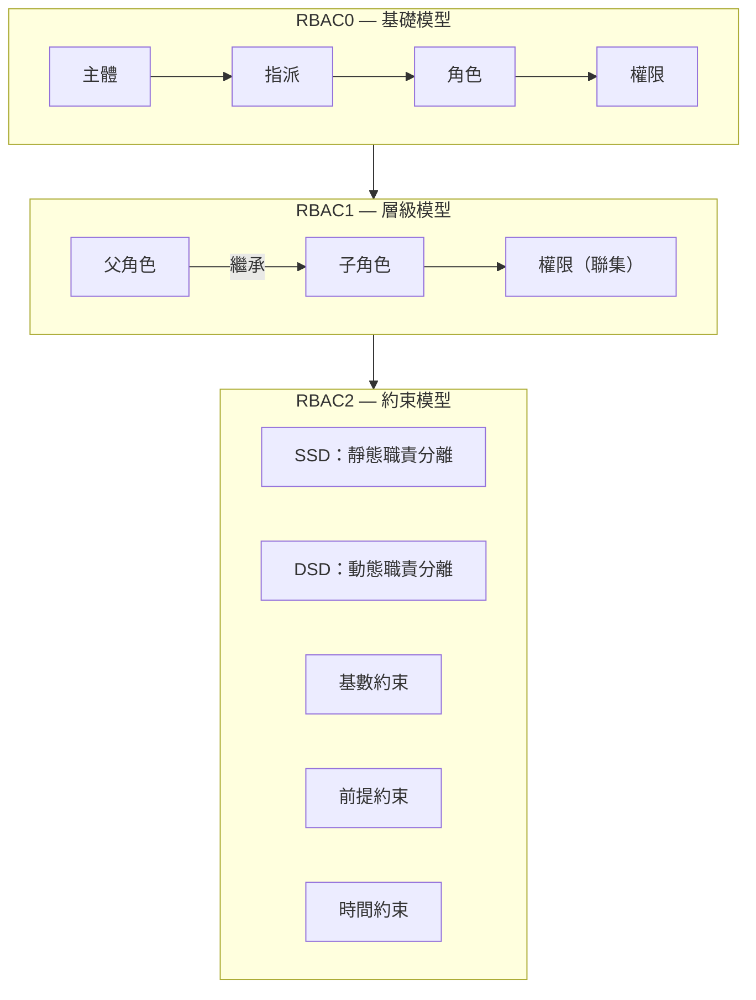
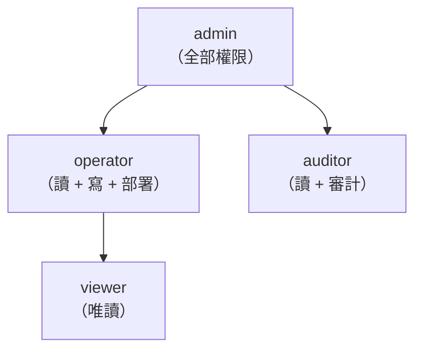
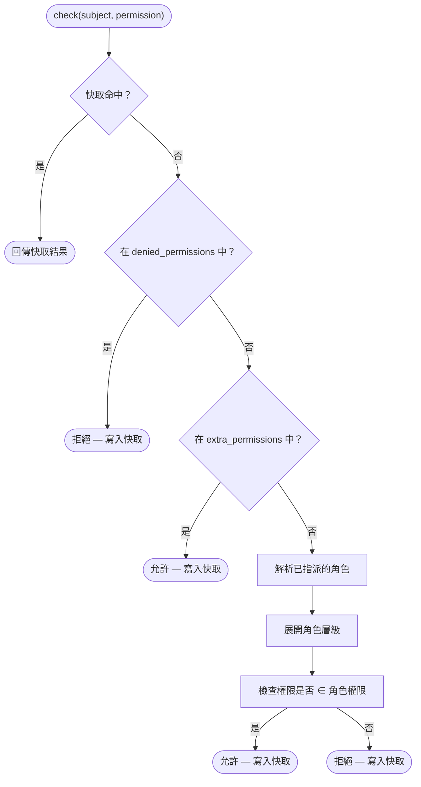
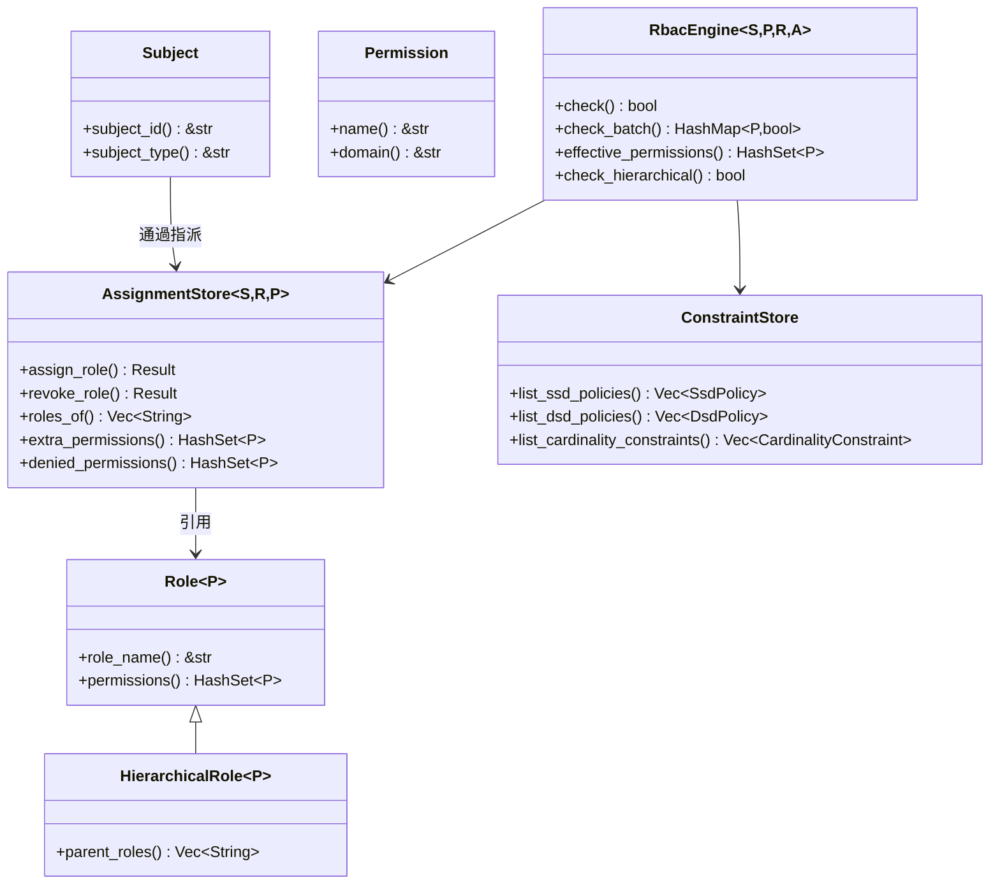

# RBAC 核心概念

## 什麼是 RBAC？

基於角色的存取控制（RBAC）是一種授權模型，它將權限指派給角色，再將角色指派給使用者（主體）。這種間接對應簡化了大規模權限管理——你不再需要為每個使用者單獨指派權限，而是將其指派給角色。

## 核心實體

### 主體 (Subject)

**主體** 是可以被授予權限的任何實體——通常是使用者、服務帳戶或自動化代理。在 kirino 中，主體需實作 `Subject` trait：

| Trait | 用途 |
|-------|---------|
| `Subject` | 所有可授權實體的基礎 trait |
| `Delegatable` | 可將其權限委派給其他主體的主體 |

### 權限 (Permission)

**權限** 是授權的最小單元——一個針對資源域的命名操作：

| Trait | 用途 |
|-------|---------|
| `Permission` | `name() -> &str` 用於序列化，`domain() -> &str` 用於分組 |

### 角色 (Role)

**角色** 是權限的命名集合：

| Trait | 用途 |
|-------|---------|
| `Role<P>` | 基礎角色：持有一組權限 |
| `HierarchicalRole<P>` | 擴展 `Role<P>`，增加 `parent_roles()` 以支援繼承 |

## RBAC 層級

Kirino 實作了 ANSI INCITS 359-2004 標準的三個層級：



### RBAC0 — 基礎模型

基礎模型：使用者被指派到角色，角色持有權限。

```
主體 ──指派──→ 角色 ──包含──→ 權限
```

- 擁有 "editor" 角色的使用者獲得 "editor" 角色中的所有權限。
- 拒絕優先語義：`denied_permissions` 優先權高於授予的權限。
- 額外權限：無需更改角色指派即可臨時提權。

### RBAC1 — 層級模型

角色可以**繼承**父角色，形成權限樹：



- 子角色繼承父角色的所有權限（聯集語義）。
- 循環檢測可防止繼承解析時的無限迴圈。
- 支援多重繼承：一個角色可以有多個父角色。

### RBAC2 — 約束模型

約束強制實施職責分離和其他業務規則：

#### 靜態職責分離 (SSD)

衝突的角色**不能指派給**同一使用者。

```
SsdPolicy { roles: {"billing", "auditor"}, cardinality: 2 }
→ 使用者不能同時持有 "billing" 和 "auditor"。
```

#### 動態職責分離 (DSD)

衝突的角色**可以指派**但**不能在同一工作階段中啟用**。

```
DsdPolicy { roles: {"author", "reviewer"}, cardinality: 2 }
→ 使用者可以是 author 又是 reviewer，但每個工作階段只能啟用一個。
```

#### 基數約束

限制可以持有某個角色的使用者數量。

```
CardinalityConstraint { role: "admin", max: 3 }
→ 最多 3 個使用者可以是管理員。
```

#### 前提約束

使用者必須先持有角色 A 才能被指派角色 B。

```
PrerequisiteConstraint { role: "operator", requires: "viewer" }
→ 只有現有的 viewer 才能被提升為 operator。
```

#### 時間約束

角色僅在時間視窗內有效。

```
TemporalConstraint { role: "temp-admin", valid_from: ..., valid_until: ... }
→ 自動過期；超過 valid_until 後自動撤銷。
```

## 決策流程

當呼叫 `RbacEngine::check(subject, permission)` 時：



關鍵語義：**拒絕優先**。被拒絕的權限無法通過角色或額外權限授權。

## 核心 Trait 總覽


