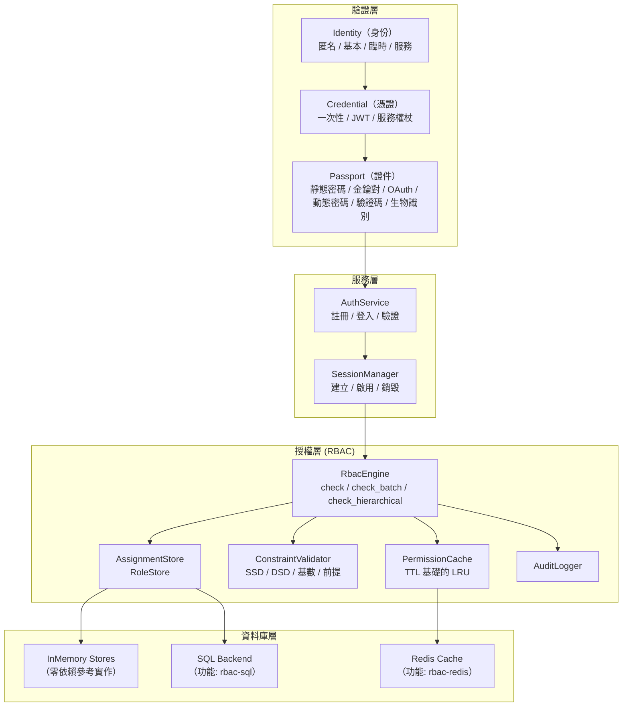
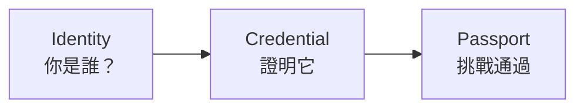
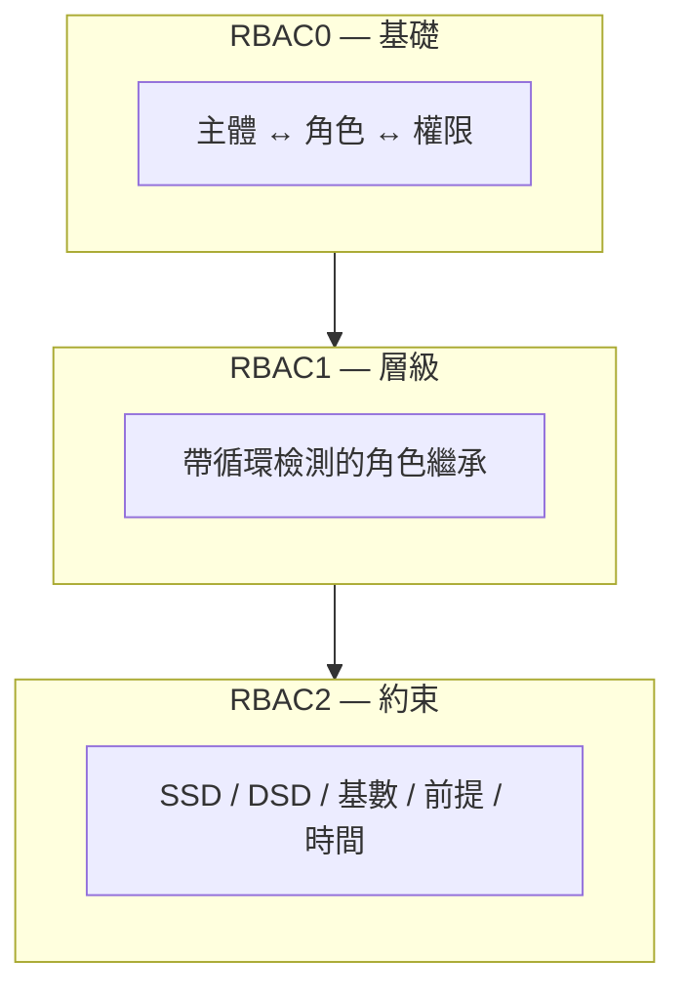
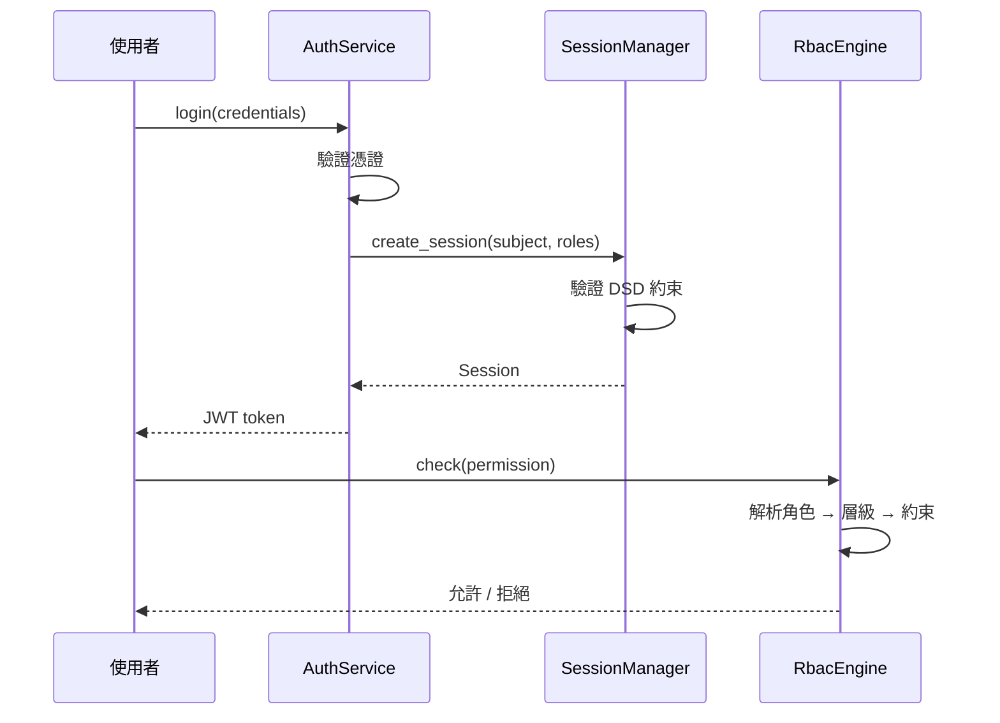

# 系統架構總覽

Kirino 是一個分層的驗證與授權框架。每一層都建立在下一層之上，並通過清晰的 trait 邊界支援自訂。

## 驗證層

Kirino 通過三步管道對使用者進行驗證：

### 身份類型

| 類型 | 說明 |
|------|-------------|
| **Anonymous（匿名）** | 未驗證訪客，最小權限 |
| **Basic（基本）** | 標準使用者，初始僅有最小權限 |
| **Temporary（臨時）** | 限時帳戶，自動過期 |
| **Service（服務）** | 用於權限委派的服務帳戶 |

### 憑證類型

| 類型 | 說明 |
|------|-------------|
| **OneTimeToken** | 一次性權杖，首次使用即消耗 |
| **Basic (JWT)** | 帶有聲明和過期時間的 JSON Web Token |
| **ServiceToken** | 服務帳戶的長期權杖 |

### 證件（挑戰）類型

| 類型 | 說明 |
|------|-------------|
| **StaticPassword** | 通過 argon2 驗證的密碼 |
| **KeyPair** | SSH 金鑰或 TLS 憑證驗證 |
| **OAuth** | 第三方 OAuth 提供方 |
| **DynamicPassword** | TOTP/HOTP、郵箱驗證碼、簡訊驗證碼 |
| **Captcha** | reCAPTCHA 或類似機器人檢測 |
| **Biological** | 指紋、聲紋、臉部辨識 |
| **TemporaryWhitelist** | 限時白名單條目 |

## 授權層

RBAC 引擎遵循 ANSI INCITS 359-2004 標準，實作了全部三個 RBAC 層級：

### 核心設計原則

1. **完全泛型**：下游專案通過 trait 定義自己的 `Permission` 和 `Subject` 類型。
2. **拒絕優先語義**：被拒絕的權限始終優先。
3. **記憶體優先**：所有後端都有零依賴參考實作。
4. **分層設計**：RBAC0/1/2 作為 `RbacEngine` 上的不同 impl 區塊分層實作。
5. **快取感知**：權限檢查通過 TTL 進行快取以提升效能。

## 工作階段管理

工作階段連接驗證與授權：

## 你應該從哪裡開始

- **快速開始**：參見 [快速開始指南](../guides/quick-start.md) 了解最小設定。
- **RBAC 概念**：參見 [RBAC 核心概念](../guides/concepts.md) 了解詳細的 RBAC 理論。
- **安裝**：參見 [安裝指南](../guides/installation.md) 了解功能旗標和依賴。
- **術語表**：參見 [術語表](../guides/glossary.md) 了解關鍵術語定義。
